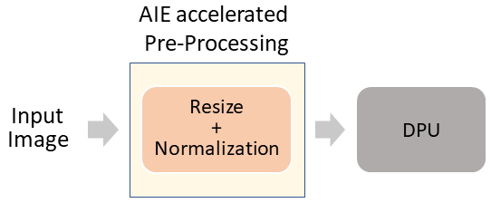

# Resnet-50
Supported Devices
- VCK190 production

VCK190 ES1 is supported with the [Known Issue](#Known-Issue).

:pushpin: **Note:** Use VAI2.5 setup to run this applicaion


## Table of Contents

- [Introduction](#Introduction)
- [Setting the SD Card and Running Resnet50 example](#Setting-the-SD-Card-and-Running-Resnet50-example)
  - [Using pre-built xclbin](#Using-pre-built-xclbin)
  - [Build flow](#Build-flow)
  - [Cross-compile Resnet50 example](#Cross-compile-Resnet50-example)
  - [Run Resnet50 Example](#Run-Resnet50-Example)  
- [Performance](#Performance)    

## Introduction
In this example, application with accelerated pre-processing using AIE kernels is providied for classification networks (Resnet-50). This application can run VCK190 platform. In this application, pre-processsing functions, including resize and normalization, are hardware accelerated and the output of the pre-processing is fed as input to the ML accelerator. The following image shows the inference pipeline.

<div align="center">
  
</div>

:pushpin: **Note:** Currently, in this application, the pre-processing accelerator only supports full-HD image resolution.

* The directory structure of the resnet50_waa_aie is as follows.

    ```
    resnet50_waa_aie
    ├── app_build.sh
    ├── app_test.sh
    ├── block_dia_classification_aie.png
    ├── build_flow
    ├── pre-built_image
    ├── README.md
    ├── resnet50.xmodel
    ├── src
    └── words.txt
    ```
* The details of each file/folder in the directory of the resnet50_waa_aie are as follows.
    ```
    resnet50_waa_aie
    ├── app_build.sh --> script to build the resnet50_waa_aie example
    ├── app_test.sh --> scriprt to test the resnet50_waa_aie app on vck190 board
    ├── block_dia_classification_aie.png --> Top-level diagram of the pipeline
    ├── build_flow --> directory to build a fresh sd_card.img
    ├── pre-built_image --> directory with pre-built sd_card.img
    ├── README.md --> Readme file with instructions
    ├── resnet50.xmodel --> Resnet50 network xmodel file
    ├── src --> resnet50_waa_aie app source code
    └── words.txt --> Resnet50 classification label file
    ```


## Setting the SD Card and Running Resnet50 example
---
Setting the SD card for running Resnet50 example on vck190 can be done in two different ways: 
1. Using pre-built xclbin 
1. Build flow

In the first approach, an existing xclbin and sd_card.img are used, whereas in the second approach fresh xclbin and sd_card.img are built following build flow. 

Once the SD card is set with the image file, running Resnet50 example is common in both the approaches.

### **1. Using pre-built xclbin**
In this approach, an existing sd_card.img file containing the xclbin, including the pre-processing accelerator and DPU, is used.
#### *Setting up VCK190 platform with the pre-built image*

* Download the VCK190 SD card image file using the below link
    
    [VCK190](https://www.xilinx.com/member/forms/download/design-license-xef.html?filename=waa_vck190_resnet50_waa_aie_v2_5_0.img.gz)

  Please note that Xilinx account sign-in is required to download the above file.
* Unzip the file and flash the `sd_card.img` file on the SD card using tools like Etcher.

### **2. Build flow**
The pre-processing accelerator and DPU are built from sources following the build flow.

| Build flow                    | Device          | Documentation                                                                          |
|-------------------------------|-----------------|----------------------------------------------------------------------------------------|
| DPUCVDX8G  | VCK190      | [DPUCVDX8G_vck190](./build_flow/DPUCVDX8G_vck190/README.md)            |

Once the sd card is flashed with sd_card.img file, either by using pre-built xclbin flow or build flow, cross-compilation is performed, followed by running the application. 
### **Cross-compile Resnet50 example**
  * Download the [sdk-2022.1.0.0.sh](https://www.xilinx.com/bin/public/openDownload?filename=sdk-2022.1.0.0.sh).

  * Install the cross-compilation system environment, follow the prompts to install. 

    **Please install it on your local host linux system.**
    ```sh
    ./sdk-2022.1.0.0.sh
    ```
    Note that the `~/petalinux_sdk` path is recommended for the installation. Regardless of the path you choose for the installation, make sure the path has read-write permissions.
     
    Here, we install it under `~/petalinux_sdk`.

  * When the installation is complete, executing the following command will set cross-compilation environment. The environment is set in the next step.
    ```sh
    source ~/petalinux_sdk/environment-setup-cortexa72-cortexa53-xilinx-linux
    ```
    Note that if you close the current terminal, you need to re-execute the above instructions in the new terminal interface.

  * Cross compile `resnet50_waa_aie` example.
    ```sh
    source < vitis-install-directory >/Vitis/2022.1/settings64.sh
    source < path-to-XRT-installation-directory >/setenv.sh
    export SYSROOT=<path to sysroot>/sysroots/aarch64-xilinx-linux/
    unset LD_LIBRARY_PATH
    source ~/petalinux_sdk/environment-setup-cortexa72-cortexa53-xilinx-linux
    export CROSS_COMPILE_ENV=~/petalinux_sdk/sysroots/cortexa72-cortexa53-xilinx-linux/
    cd  ${VAI_HOME}/examples/Whole-App-Acceleration/apps/resnet50_waa_aie
    bash -x app_build.sh
    ```
      If the compilation process does not report any error and the executable file `./bin/resnet50_waa_aie.exe` is generated , then the host environment is installed correctly.

### **Run Resnet50 Example**
  This section gives details to run the Resnet50 example on vck190 board.

  * Download/copy your full-HD images to ` ${VAI_HOME}/examples/Whole-App-Acceleration/apps/resnet50_waa_aie/img` directory.

  * Download the Vitis-AI runtime

    ```sh
    wget https://www.xilinx.com/bin/public/openDownload?filename=vitis-ai-runtime-2.5.0.tar.gz -O vitis-ai-runtime-2.5.0.tar.gz

    tar -xzvf vitis-ai-runtime-2.5.0.tar.gz
    ```
  * Download model files for Resnet50
    ```sh  
    cd ${VAI_HOME}/examples/Whole-App-Acceleration/apps/resnet50_waa_aie
    mkdir model_files
    cd model_files
    wget https://www.xilinx.com/bin/public/openDownload?filename=resnet50-vck190-r2.0.0.tar.gz -O resnet50-vck190-r2.0.0.tar.gz
    tar -xzvf resnet50-vck190-r2.0.0.tar.gz
    ```
  Please note that the extracted folder and the model name may vary. Use appropriate name or path to the model file while running the application.
    
  * Create `resnet50_waa_aie` in the BOOT partition `/run/media/mmcblk0p1/` of the SD Card. Then copy the following contents to the `resnet50_waa_aie` directory.
    ```
        app_test.sh
        bin
        img
        model_files
        words.txt
        vitis-ai-runtime-2.5.0
    ```

  * Please insert SD_CARD into the VCK190 board. After the linux boot, run the following to install Vitis AI runtime libraries and to perform various tests.
  * Installing Vitis AI Runtime on the Evaluation Board
    ```sh
    cd /run/media/mmcblk0p1/
    cp -r vitis-ai-runtime-2.5.0/2022.1/aarch64/centos ~/
    cd ~/centos
    bash setup.sh
    ```
  
  * Performance test with & without WAA
    ```sh
    cd /run/media/mmcblk0p1/resnet50_waa_aie
    export XLNX_VART_FIRMWARE=/run/media/mmcblk0p1/dpu.xclbin
    ./app_test.sh --xmodel_file ./model_files/resnet50/resnet50.xmodel --image_dir img/ --no_zero_copy --performance_diff
    
    # Expect similar output
         Running Performance Diff: 

           Running Application with Software Preprocessing 

           E2E Performance: 255.95 fps
           Pre-process Latency: 3.06 ms
           Execution Latency: 0.77 ms
           Post-process Latency: 0.08 ms

           Running Application with Hardware Preprocessing 

           E2E Performance: 441.52 fps
           Pre-process Latency: 1.23 ms
           Execution Latency: 0.77 ms
           Post-process Latency: 0.08 ms

           The percentage improvement in throughput is 72.50 %  
    ```
    The performance_diff numbers are obtained for img directory containing 984 full-HD images randomly picked from ImageNet dataset.

  * Functionality test with two images using WAA
    ```sh
    cd /run/media/mmcblk0p1/resnet50_waa_aie
    export XLNX_VART_FIRMWARE=/run/media/mmcblk0p1/dpu.xclbin
    ./app_test.sh --xmodel_file ./model_files/resnet50/resnet50.xmodel --image_dir img/ --verbose --no_zero_copy
    # Expect similar output:
        Initializing ADF API...
        WARNING: Logging before InitGoogleLogging() is written to STDERR
        I0118 22:47:16.290235  2315 main.cc:545] create running for subgraph: subgraph_conv1
        XAIEFAL: INFO: Resource group Avail is created.
        XAIEFAL: INFO: Resource group Static is created.
        XAIEFAL: INFO: Resource group Generic is created.
        Number of images in the image directory is: 2
        XAIEFAL: INFO: Resource group Avail is created.
        XAIEFAL: INFO: Resource group Static is created.
        XAIEFAL: INFO: Resource group Generic is created.
        Loading kernel Tiler_top:{Tiler_top_1}
        Loading kernel stitcher_top:{stitcher_top_1}

        top[0] prob = 0.082919  name = digital clock
        top[1] prob = 0.064577  name = matchstick
        top[2] prob = 0.050293  name = spotlight, spot
        top[3] prob = 0.050293  name = nematode, nematode worm, roundworm
        top[4] prob = 0.030504  name = analog clock
        top[0] prob = 0.541243  name = espresso
        top[1] prob = 0.155069  name = eggnog
        top[2] prob = 0.120768  name = coffee mug
        top[3] prob = 0.094054  name = cup
        top[4] prob = 0.044428  name = soup bowl
        top[0] prob = 0.992576  name = collie
        top[1] prob = 0.006688  name = Shetland sheepdog, Shetland sheep dog, Shetland
        top[2] prob = 0.000549  name = borzoi, Russian wolfhound
        top[3] prob = 0.000027  name = groenendael
        top[4] prob = 0.000027  name = Afghan hound, Afghan
    ```
:pushpin: **Note:** The hardware pre-processing accelerator outputs the pre-processed image one frame later. For example, the pre-processed output of `(i)th` image from the hardware accelerator is at `(i+1)th` iteration.

  * Functionality test with two images without WAA (software preprocessing)
    ```sh
    cd /run/media/mmcblk0p1/resnet50_waa_aie
    ./app_test.sh --xmodel_file ./model_files/resnet50/resnet50.xmodel --image_dir img/ --verbose --use_sw_pre_proc

    # Expect similar output:
        Initializing ADF API...
        WARNING: Logging before InitGoogleLogging() is written to STDERR
        I0118 22:49:05.984040  2320 main.cc:545] create running for subgraph: subgraph_conv1
        XAIEFAL: INFO: Resource group Avail is created.
        XAIEFAL: INFO: Resource group Static is created.
        XAIEFAL: INFO: Resource group Generic is created.
        Number of images in the image directory is: 2
        top[0] prob = 0.568391  name = espresso
        top[1] prob = 0.126825  name = eggnog
        top[2] prob = 0.098772  name = cup
        top[3] prob = 0.098772  name = coffee mug
        top[4] prob = 0.059908  name = soup bowl
        top[0] prob = 0.992575  name = collie
        top[1] prob = 0.006688  name = Shetland sheepdog, Shetland sheep dog, Shetland
        top[2] prob = 0.000549  name = borzoi, Russian wolfhound
        top[3] prob = 0.000027  name = groenendael
        top[4] prob = 0.000021  name = Afghan hound, Afghan
    ```

## Performance
Below table shows the comparison of performance achieved by accelerating the pre-processing pipeline on FPGA.
The performance numbers are obtained by running the app for 984 full-HD images randomly picked from ImageNet dataset.

<table style="undefined;table-layout: fixed; width: 664px">
<colgroup>
<col style="width: 119px">
<col style="width: 136px">
<col style="width: 145px">
<col style="width: 134px">
</colgroup>
  <tr>
    <th rowspan="2">Device</th>
    <th colspan="2">Performance (FPS)</th>
    <th rowspan="2"><span style="font-weight:bold">Improvement</span></th>
  </tr>
  <tr>
    <td>with software Pre-processing</td>
    <td>with hardware Pre-processing</td>
  </tr>
  <tr>
    <td>VCK190 </td>
    <td>255.95 </td>
    <td>441.52 </td>
    <td>72.50 %</td>
  </tr>

</table>

:pushpin: **Note:** The above performance numbers doesn't consider the image read time.

:pushpin: **Note:** Performance numbers are computed using end-to-end latency and it depends on input image resolution. So, the performance numbers may vary with image resolution.

## Known Issue
### Running the Resnet50 application on VCK190 ES1 device
Following the build flow, xclbin for an ES1 device can be obtained. Later, please refer the [Workaround for ES1 device](https://github.com/Xilinx/Vitis-AI/tree/v2.0/dsa/XVDPU-TRD#9-known-issue) for running the resnet50_waa_aie application on VCK190 ES1 devices.
