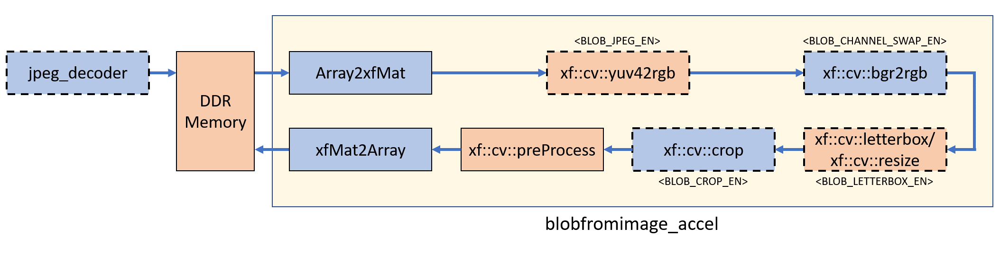

# Pre-process Accelerator

xf_blobfromimage_accel.cpp is the pre-process accelerator file which consists of following submodules:

- Array2xfMat : Data adapter for conversion of pointer to xf::Mat
- xf::cv::yuv42rgb : Color space conversion from yuv to rgb
- xf::cv::bgr2rgb : Swap blue and red channels
- xf::cv::resize : Image resize
- xf::cv::letterbox : Image resize by preserving the aspect ratio
- xf::cv::crop : Crop ROI of an input image
- xf::cv::preProcess : Mean subtraction and scaling
- xfMat2Array : Data adapter for conversion of xf::Mat to pointer
- jpeg_decoder : Decode JPEG image to YUV444 format

Some of the above submodules are optional and are controlled by arguments such as BLOB_CHANNEL_SWAP_EN, BLOB_CROP_EN, BLOB_LETTERBOX_EN, BLOB_JPEG_EN, etc.

  
  

