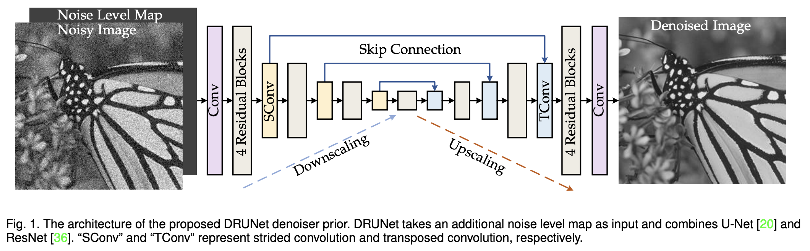
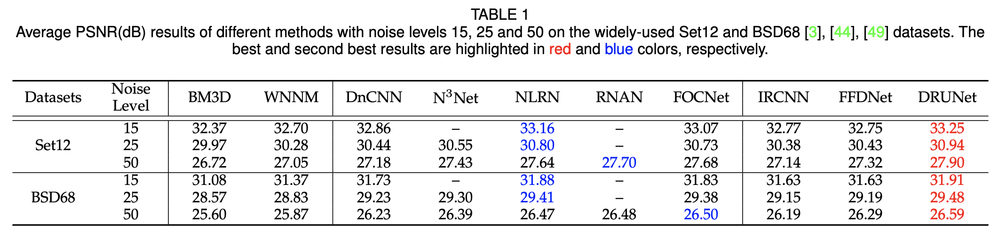

# Contents

- [Contents](#contents)
- [Model Description](#model-description)
  - [Description](#description)
  - [Paper](#paper)
- [Model Architecture](#model-architecture)
- [Dataset](#dataset)
- [Features](#features)
- [Environment Requirements](#environment-requirements)
- [Quick Start](#quick-start)
- [Script Description](#script-description)
  - [Structure](#structure)
  - [Script Parameters](#script-parameters)
  - [Data Preprocessing](#data-preprocessing)
  - [Inference Process](#inference-process)
- [Performance](#performance)
  - [Evaluation Performance](#evaluation-performance)
  - [Inference Performance](#inference-performance)
- [Links](#links)
- [Vitis AI Model Zoo Homepage](#vitis-ai-model-zoo-homepage)

# Model Description

## Description

A Dilated-Residual U-Net Deep Learning Network for Image Denoising. It combines the strengths of the U-Net architecture
and dilated convolutions, along with residual connections, to effectively remove noise from images
while preserving important image details.

## Paper

Krishna Devalla, Sripad, et al. "DRUNET: A Dilated-Residual U-Net Deep Learning Network to Digitally Stain Optic
Nerve Head Tissues in Optical Coherence Tomography Images." arXiv e-prints (2018):
[arXiv-1803](https://arxiv.org/abs/1803.00232).

# Model Architecture

A Dilated-Residual U-Net architecture leverages a combination of U-Net structure, dilated convolutions,
residual connections, and skip connections. This combination enables the model to capture both local and global
contextual information, propagate gradients effectively, and recover fine details, ultimately leading
to high-quality image denoising results.


# Dataset

Dataset for testing: CBSD68. The CBSD68  dataset is a widely used benchmark dataset for image denoising. CBSD stands for "Color and Binary Shape Database".
It consists of 68 grayscale images with various scenes and objects.

Link to download the  dataset: https://github.com/clausmichele/CBSD68-dataset

# Features

The notable features of the Dilated-Residual U-Net:

1. **U-Net Architecture**: Enables contextual information capture and spatial detail recovery.
2. **Dilated Convolutions**: Captures both local and global contextual information.
3. **Residual Connections**: Efficiently propagates gradients and preserves important features.
4. **Skip Connections**: Merges high-resolution and low-resolution features to recover fine details.
5. **Multi-Scale Information Fusion**: Considers information at multiple scales for effective denoising.

# Environment Requirements

Before running the model inference, make sure that the latest version of
[Vitis-AI](https://xilinx.github.io/Vitis-AI/docs/install/install.html) is installed and the host computer fully supports
Xilinx FPGA/ACAP and the appropriate accelerator is installed correctly, e.g. Xilinx VCK5000 Versal.

# Quick Start

Follow the [Quick Start guide](../../../README.md#quick-start) in the main Model Zoo README:

1. Install the Vitis-AI
2. Run the docker container
3. Download test data
4. Run the inference of the model

# Script Description

## Structure

```text
.
├── artifacts                   # models binaries and inference result files
├── scripts   
│   ├── config.env              # environment variables setting   
│   └── inference.sh            # script for getting model's inference
└── src   
    ├── dataset.py              # data preparation  
    └── metric.py               # model results evaluation
```

## Script Parameters

Inference:

```text
model_path                   # The path to the model binary .xmodel
filepaths                    # The list of files for inference
results_folder               # The directory where model's inference results are stored.
```

## Data Preprocessing

> **Warning**
> Python scripts should be started in virtual environment. To set it up, use:
>
> ```bash
> bash scripts/setup_venv.sh
> source .venv/bin/activate
> ```

To prepare the dataset catalog structure, you may use:

```python
python src/dataset.py [DATASET FOLDER]
```

## Inference Process

- Native inference - follow the [Quick Start guide](../../../README.md#quick-start) in the main Model Zoo
- AMD Server

# Performance

## Evaluation Performance

To evaluate the model inference results, you may compute [PNSR](https://en.wikipedia.org/wiki/Peak_signal-to-noise_ratio) metric.
Use the following script:

```python
python src/metric.py [DATASET FOLDER] [INFERENCE FOLDER]
```

To get performance report, use:

```python
python src/eval.py [INFERENCE FOLDER] [MODEL NAME]
```

## Inference Performance

- Original paper results of mean PNSR metric
  
- Comparison with SOTA on PNSR metric with different noise level:


  |                                                                                     | [Sigma15](https://paperswithcode.com/sota/grayscale-image-denoising-on-bsd68-sigma15) | [Sigma25](https://paperswithcode.com/sota/color-image-denoising-on-cbsd68-sigma25) | [Sigma50](https://paperswithcode.com/sota/color-image-denoising-on-cbsd68-sigma50) |
  | ----------------------------------------------------------------------------------: | ------------------------------------------------------------------------------------- | ---------------------------------------------------------------------------------- | ---------------------------------------------------------------------------------- |
  |                                                                              DRUNet | 31.91                                                                                 | 29.48                                                                              | 26.59                                                                              |
  | [ADL](https://paperswithcode.com/paper/adversarial-distortion-learning-for-medical) | 32.11                                                                                 | 29.50                                                                              | 26.87                                                                              |
  |      [KBNet](https://paperswithcode.com/paper/kbnet-kernel-basis-network-for-image) | 31.98                                                                                 | 29.54                                                                              | 26.65                                                                              |

# Links

- The Berkeley Segmentation Dataset and Benchmark (original): https://www2.eecs.berkeley.edu/Research/Projects/CS/vision/bsds/
- CBSD68-dataset for image denoising benchmarks: https://github.com/clausmichele/CBSD68-dataset
- Plug-and-Play Image Restoration with Deep Denoiser Prior: https://arxiv.org/pdf/2008.13751.pdf
- Learning Deep CNN Denoiser Prior for Image Restoration: https://arxiv.org/pdf/1704.03264.pdf
- Benchmarks based on the CBSD68-dataset with SOTA solutions: https://paperswithcode.com/dataset/cbsd68

# Vitis AI Model Zoo Homepage

Check the official Vitis AI Model Zoo [homepage](https://github.com/Xilinx/Vitis-AI/tree/master/model_zoo).
