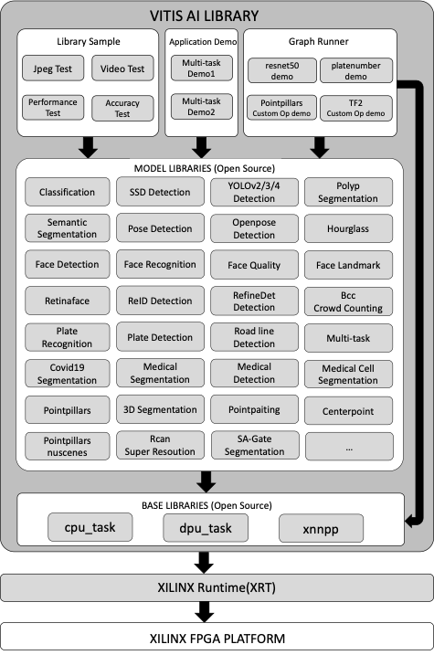

<table class="sphinxhide">
 <tr>
   <td align="center"><h1>Vitis AI</h1><h0>Adaptable & Real-Time AI Inference Acceleration</h0>
   </td>
 </tr>
</table>

# Vitis AI Library v3.5

## Introduction
The Vitis AI Library is a set of high-level libraries and APIs built for efficient AI inference with Deep-Learning Processor Unit (DPU). It is built based on the Vitis AI Runtime with Unified APIs, and it fully supports XRT 2023.1.

The Vitis AI Library provides an easy-to-use and unified interface by encapsulating many efficient and high-quality neural networks. This simplifies the use of deep-learning neural networks, even for users without knowledge of deep-learning or FPGAs. The Vitis AI Library allows users to focus more on the development of their applications, rather than the underlying hardware.

For edge users, click 
[Quick Start For Edge](#quick-start-for-edge) to get started quickly. 

For cloud users, click 
[Quick Start For Cloud](#quick-start-for-cloud) to get started quickly.

## Key Features And Enhancements in 3.5 Release
1. New Board Support: Versal Series VEK280, V70 are supported
2. New Runtime Enhancement:
    ONNX Runtime Vitis AI Execution Provider (Vitis AI EP) is provided to hardware-accelerated AI inference with DPUs. It supports both C++ and Python API in this release.
3. New Model Libraries:  
	* YOLOv7 Detection
	* YOLOv8 Detection
	* 2DUnet

4. Up to 5 new models are supported:
	* Added 4 new Pytorch models
	* Added 1 Tensorflow2 model


## Block Diagram

<p align="center">
  
</p>


## Quick Start For Edge
### Setting Up the Host
1. Follow steps in [Setting Up the Host](../vai_runtime/quick_start_for_embedded.md#setting-up-the-host) to set up the host for edge.

2. To modify the library source code, view and modify them under `~/Vitis-AI/src/vai_library`.
	Before compiling the AI libraries, please confirm the compiled output path. The default output path is : `$HOME/build`.
	If you want to change the default output path, please modify the `build_dir_default` in cmake.sh. 
	Execute the following command to build the libraries all at once.
```
cd ~/Vitis-AI/src/vai_library
./cmake.sh --clean
```

### Setting Up the Target  
For `VEK280`, follow steps in [Setting Up the Target](https://xilinx.github.io/Vitis-AI/3.5/html/docs/quickstart/vek280.html#setup-the-target) to set up the target.  

### Running Vitis AI Library Examples

1. Download the [vitis_ai_library_r3.5.0_images.tar.gz](https://www.xilinx.com/bin/public/openDownload?filename=vitis_ai_library_r3.5.0_images.tar.gz) and 
the [vitis_ai_library_r3.5.0_video.tar.gz](https://www.xilinx.com/bin/public/openDownload?filename=vitis_ai_library_r3.5.0_video.tar.gz). Copy them from host to the target using scp with the following command.
```
[Host]$scp vitis_ai_library_r3.5.*_images.tar.gz root@IP_OF_BOARD:~/
[Host]$scp vitis_ai_library_r3.5.*_video.tar.gz root@IP_OF_BOARD:~/
```
2. Untar the image and video packages on the target.
```
cd ~
tar -xzvf vitis_ai_library_r3.5.*_images.tar.gz -C Vitis-AI/examples/vai_library
tar -xzvf vitis_ai_library_r3.5.*_video.tar.gz -C Vitis-AI/examples/vai_library
```
3. Enter the directory of example in target board, take `classification` as an example.
```
cd ~/Vitis-AI/examples/vai_library/samples/classification
```
4. Run the image test example.
```
./test_jpeg_classification resnet50_pt sample_classification.jpg
```

5. Run the video test example.
```
./test_video_classification resnet50_pt video_input.webm -t 4

Video_input.mp4: The video file's name for the input. The user needs to prepare the video file by themselves.
-t: <num_of_threads>
```

Note that, for examples with video input, only `webm` and `raw` format are supported by default with the official system image. 
If you want to support video data in other formats, you need to install the relevant packages on the system. 

6. To test the program with a USB camera as input, run the following command:
```
./test_video_classification resnet50_pt 0 -t 4

0: The first USB camera device node. If you have multiple USB cameras, the value might be 1,2,3 etc.
-t: <num_of_threads>
```
7. To test the performance of model, run the following command:
```
./test_performance_classification resnet50_pt test_performance_classification.list -t 8 -s 60

-t: <num_of_threads>
-s: <num_of_seconds>
```
8. To test the accuracy of model, the user needs to prepare the test data by themselves, please refer to [vitis-ai-library-user-guide](https://docs.xilinx.com/r/en-US/ug1354-xilinx-ai-sdk) section "Model Accuracy Test" for more detail.


## Quick Start For Cloud
### Setting Up the Host

For `V70` Card, follow [Setup V70 Accelerator Card](https://xilinx.github.io/Vitis-AI/3.5/html/docs/quickstart/v70.html#alveo-v70-setup) to set up the host.

### <div id="idu50"></div>Running Vitis AI Library Examples on V70

Suppose you have downloaded `Vitis-AI`, entered `Vitis-AI` directory, and then started Docker image. 
Thus, `vai_libray` examples are located in the path of `/workspace/examples/vai_library/` in the docker system. 

**`/workspace/examples/vai_library/` is the path for the following example.**
 
If you encounter any path errors in running examples, check to see if you follow the steps above.

1. Select the model for your platforms.
	For each model, there will be a yaml file which is used for describe all the details about the model. 
	In the yaml file, you will find the model's download links for different platforms. Please choose the corresponding model and download it. Click [Xilinx AI Model Zoo](../../model_zoo/model-list) to view all the models. Take [pytorch resnet50 yaml file](../../model_zoo/model-list/pt_resnet50_3.5/model.yaml) as an example.

	* If the `/usr/share/vitis_ai_library/models` folder does not exist, create it first.
	```
	  sudo mkdir /usr/share/vitis_ai_library/models
	```

	* For DPUCV2DX8G DPU IP of V70 card, install the model package as follows.
	```
	  wget https://www.xilinx.com/bin/public/openDownload?filename=resnet50_pt-v70-DPUCV2DX8G-r3.5.0.tar.gz -O resnet50_pt-v70-DPUCV2DX8G-r3.5.0.tar.gz
	  tar -xzvf resnet50-pt-v70-DPUCV2DX8G-r3.5.0.tar.gz
	  sudo cp resnet50_pt /usr/share/vitis_ai_library/models -r
	```

**Note that different Versal cards DPU IP correspond to different model files, which cannot be used alternately.** 

2. Download the [vitis_ai_library_r3.5.0_images.tar.gz](https://www.xilinx.com/bin/public/openDownload?filename=vitis_ai_library_r3.5.0_images.tar.gz) and [vitis_ai_library_r3.5.0_video.tar.gz](https://www.xilinx.com/bin/public/openDownload?filename=vitis_ai_library_r3.5.0_video.tar.gz) packages and untar them.
```
cd /workspace
wget https://www.xilinx.com/bin/public/openDownload?filename=vitis_ai_library_r3.5.0_images.tar.gz -O vitis_ai_library_r3.5.0_images.tar.gz
wget https://www.xilinx.com/bin/public/openDownload?filename=vitis_ai_library_r3.5.0_video.tar.gz -O vitis_ai_library_r3.5.0_video.tar.gz
tar -xzvf vitis_ai_library_r3.5.0_images.tar.gz -C examples/vai_library/
tar -xzvf vitis_ai_library_r3.5.0_video.tar.gz -C examples/vai_library/
```
3. Enter the directory of sample and then compile it.
```
cd /workspace/examples/vai_library/samples/classification
bash -x build.sh
```
4. Run the image test example.
```
./test_jpeg_classification resnet50_pt sample_classification.jpg
```
5. Run the video test example.
```
./test_video_classification resnet50_pt <video_input.mp4> -t 8

Video_input.mp4: The video file's name for input. The user needs to prepare the video file by themselves.
-t: <num_of_threads>
```
6. To test the performance of model, run the following command:
```
./test_performance_classification resnet50_pt test_performance_classification.list -t 8 -s 60

-t: <num_of_threads>
-s: <num_of_seconds>
```
7. To test the accuracy of model, the user needs to prepare the test data by themselves, please refer to [vitis-ai-library-user-guide](https://docs.xilinx.com/r/en-US/ug1354-xilinx-ai-sdk) section "Model Accuracy Test" for more detail.


## Tools
In this release, `xdputil` tool is introduced for board developing. It's preinstalled in the latest board image. The source code of `xdputil` is under `usefultools`.
* Show device information, including DPU, fingerprint and VAI version. 
```
xdputil query
```
* Show the status of DPU
```
xdputil status
```
**Note: Please set the env `export TARGET_DEVICE=V70` if run the command on V70**

* Run DPU with the input file.
```
xdputil run <xmodel> [-i <subgraph_index>] <input_bin>

xmodel: The model run on DPU
-i : The subgraph_index of the model, index starts from 0, -1 means running the whole graph, the default value is 1
input_bin: The input file for the model
```
* Show xmodel information, including xmodel's inputs&outputs and kernels
```
xdputil xmodel <xmodel> -l
```
* Convert xmodel to the other format
```
xdputil xmodel <xmodel> -t <TXT> 
xdputil xmodel <xmodel> -s <SVG>
xdputil xmodel <xmodel> -p <PNG> 
```
* Show the OP information
```
xdputil xmodel <xmodel> --op <OP name>
```
* Test xmodel performance
```
xdputil benchmark <xmodel> [-i subgraph_index] <num_of_threads>

-i : The subgraph_index of the model, index starts from 0, -1 means running the whole graph.
```
* Test custom Op
```
xdputil run_op <xmodel> <op_name> [-r REF_DIR] [-d DUMP_DIR]
```
For more usage of `xdputil`, execute `xdputil -h`.

## Reference
For more information, please refer to [vitis-ai-library-user-guide](https://docs.xilinx.com/r/en-US/ug1354-xilinx-ai-sdk).
