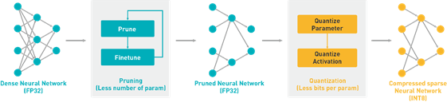
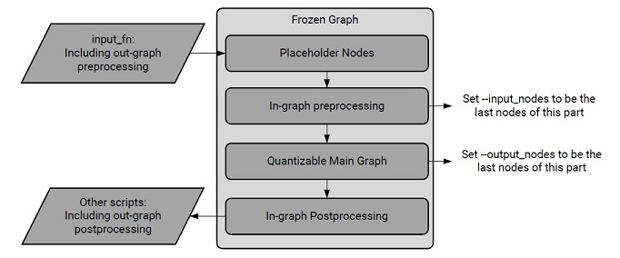

# Vitis AI Quantizer for TensorFlow (vai_q_tensorflow)
This is Xilinx Vitis AI quantizer for TensorFlow. It is a Xilinx maintained plug-in tool for tensorflow 1.15. vai_q_tensorflow supports FPGA friendly quantization for Tensorflow models. After quantization, models can be deployed to FPGA devices. vai_q_tensorflow is a component of Xilinx [Vitis AI](https://github.com/Xilinx/Vitis-AI), which is Xilinx’s development stack for AI inference on Xilinx hardware platforms.

* Note: Users can download the Xilinx prebuilt version in [Xilinx Vitis AI](https://www.xilinx.com/products/design-tools/vitis.html).

## Installation
Tested Environment:
* Ubuntu 16.04
* GCC 7.3
* Python 3.6
* CUDA 10.0 + CUDNN 7.6.5
* cmake version 3.15.0
* make 4.1
* swig 3.0

Prerequisite: 

* Install swig
* (GPU version) Install CUDA and CUDNN
* Install python prerequistes:
```shell
$ pip install -r requirements.txt 
```

Build wheel package and install:
```shell
# GPU version
$ sh build.sh
# CPU-only version
$ sh build.sh CPU
```

Validate Installation
```shell
$ vai_q_tensorflow --version
$ vai_q_tensorflow --help
```

## Quantization Overview
The process of inference is computation intensive and requires a high memory bandwidth to satisfy the low-latency and high-throughput requirement of edge applications.

Quantization and channel pruning techniques are employed to address these issues while achieving high performance and high energy efficiency with little degradation in accuracy. Quantization makes it possible to use integer computing units and to represent weights and activations by lower bits, while pruning reduces the overall required operations. In the Vitis AI quantizer, only the quantization tool is included. The pruning tool is packaged in the Vitis AI optimizer. Contact the support team for the Vitis AI development kit if you require the pruning tool.


<div align="center">
  
</div>

Generally, 32-bit floating-point weights and activation values are used when training neural networks. By converting the 32-bit floating-point weights and activations to 8-bit integer (INT8) format, the Vitis AI quantizer can reduce computing complexity without losing prediction accuracy. The fixed-point network model requires less memory bandwidth, thus providing faster speed and higher power efficiency than the floating-point model. The Vitis AI quantizer supports common layers in neural networks, such as convolution, pooling, fully connected, and batchnorm.

The Vitis AI quantizer now supports TensorFlow and Caffe (the quantizer names are vai_q_tensorflow and vai_q_caffe respectively). The vai_q_tensorflow quantizer is based on Tensorflow 1.15.2. 

In the quantize calibration process, only a small set of unlabeled images are required to analyze the distribution of activations. The running time of quantize calibration varies from a few seconds to several minutes, depending on the size of the neural network. Generally, there is a little decline in accuracy after quantization. However, for some networks such as Mobilenets, the accuracy loss might be large. In this situation, quantize finetuning can be used to further improve the accuracy of quantized models. Quantize finetuning requires the original train dataset. According to experiments, several epochs of finetuning are needed and the finetune time varies from several minutes to several hours.

## Running vai_q_tensorflow
### Preparing the Float Model and Related Input Files
Before running vai_q_tensorflow, prepare the frozen inference TensorFlow model in floatingpoint
format and calibration set, including the files listed in the following table.

*Table 1. Input Files for vai_q_tensorflow*

|No.|Name|Description|
| :--- | :--- | :--- |
|1|frozen_graph.pb|Floating-point frozen inference graph. Ensure that the graph is the inference graph rather than the training graph.|
|2|calibration dataset|A subset of the training dataset containing 100 to 1000 images.|
|3|input_fn|An input function to convert the calibration dataset to the input data of the frozen_graph during quantize calibration. Usually performs data pre-processing and augmentation.|

#### **Generating the Frozen Inference Graph**
Training a model with TensorFlow 1.x creates a folder containing a GraphDef file (usually ending with *a.pb* or *.pbtxt* extension) and a set of checkpoint files. What you need for mobile or embedded deployment is a single GraphDef file that has been “frozen,” or had its variables converted into inline constants, so everything is in one file. To handle the conversion, TensorFlow provides *freeze_graph.py*, which is automatically installed with the vai_q_tensorflow quantizer.

An example of command-line usage is as follows:
```shell
$ freeze_graph \
--input_graph /tmp/inception_v1_inf_graph.pb \
--input_checkpoint /tmp/checkpoints/model.ckpt-1000 \
--input_binary true \
--output_graph /tmp/frozen_graph.pb \
--output_node_names InceptionV1/Predictions/Reshape_1
```
The *–input_graph* should be an inference graph other than the training graph. Because the operations of data preprocessing and loss functions are not needed for inference and deployment, the *frozen_graph.pb* should only include the main part of the model. In particular, the data preprocessing operations should be taken in the *input_fn* to generate correct input data for quantize calibration.

***Note:*** Some operations, such as dropout and batchnorm, behave differently in the training and inference phases. Ensure that they are in the inference phase when freezing the graph. For examples, you can set the flag *is_training=false* when using *tf.layers.dropout/tf.layers.batch_normalization*. For models using *tf.keras*, call *tf.keras.backend.set_learning_phase(0)* before building the graph.

***TIP***: Type *freeze_graph --help* for more options.

The input and output node names vary depending on the model, but you can inspect and estimate them with the vai_q_tensorflow quantizer. See the following code snippet for an example:
```shell
$ vai_q_tensorflow inspect --input_frozen_graph=/tmp/inception_v1_inf_graph.pb
```

The estimated input and output nodes cannot be used for quantization if the graph has in-graph pre- and post-processing. This is because some operations are not quantizable and can cause errors when compiled by the Vitis AI compiler, if you deploy the quantized model to the DPU.

Another way to get the input and output name of the graph is by visualizing the graph. Both TensorBoard and Netron can do this. See the following example, which uses Netron:

```shell
$ pip install netron
$ netron /tmp/inception_v3_inf_graph.pb
```

#### **Preparing the Calibration Dataset and Input Function**
The calibration set is usually a subset of the training/validation dataset or actual application images (at least 100 images for performance). The input function is a Python importable function to load the calibration dataset and perform data preprocessing. The vai_q_tensorflow quantizer can accept an input_fn to do the preprocessing, which is not saved in the graph. If the preprocessing subgraph is saved into the frozen graph, the input_fn only needs to read the images from dataset and return a feed_dict.

The format of input function is *module_name.input_fn_name*, (for example,
*my_input_fn.calib_input*). The input_fn takes an int object as input, indicating the calibration step number, and returns a dict ("*placeholder_name, numpy.Array*") object for each call, which is fed into the placeholder nodes of the model when running inference. The *placeholder_name* is always the input node of frozen graph, that is to say, the node receiving input data. The *input_nodes*, in the vai_q_tensorflow options, indicates where quantization starts in the frozen graph. Note that the *placeholder_names* and the *input_nodes* option are sometimes different. For example, when the frozen graph includes in-graph preprocessing, the placeholder_name is the input of the graph though it is recommended that *input_nodes* be set to the last node of preprocessing. The shape of *numpy.array* must be consistent with the placeholders. See the following pseudo code example:

```python
$ “my_input_fn.py”
def calib_input(iter):
"""
A function that provides input data for the calibration
Args:
iter: A `int` object, indicating the calibration step number
Returns:
dict( placeholder_name, numpy.array): a `dict` object, which will be fed into the model
"""
image = load_image(iter)
preprocessed_image = do_preprocess(image)
return {"placeholder_name": preprocessed_images}
```

### Quantizing the Model Using vai_q_tensorflow
Run the following commands to quantize the model:
```shell
$vai_q_tensorflow quantize \
--input_frozen_graph frozen_graph.pb \
--input_nodes ${input_nodes} \
--input_shapes ${input_shapes} \
--output_nodes ${output_nodes} \
--input_fn input_fn \
[options]
```
The input_nodes and output_nodes arguments are the name list of input nodes of the quantize graph. They are the start and end points of quantization. The main graph between them is quantized if it is quantizable, as shown in the following figure.

<div align="center">
  
</div>

It is recommended to set *–input_nodes* to be the last nodes of the preprocessing part and to set *-output_nodes* to be the last nodes of the main graph part because some operations in the pre- and postprocessing parts are not quantizable and might cause errors when compiled by the Vitis AI quantizer if you need to deploy the quantized model to the DPU.

The input nodes might not be the same as the placeholder nodes of the graph. If no in-graph preprocessing part is present in the frozen graph, the placeholder nodes should be set to input nodes.

The *input_fn* should be consistent with the placeholder nodes.

[options] stands for optional parameters. The most commonly used options are as follows:

- **weight_bit**: Bit width for quantized weight and bias (default is 8).

- **activation_bit**: Bit width for quantized activation (default is 8).

- **method**: Quantization methods, including 0 for non-overflow, 1 for min-diffs, and 2 for mindiffs with normalization. The non-overflow method ensures that no values are saturated.

### Generating the Quantized Model

After the successful execution of the *vai_q_tensorflow* command, one output file is generated in the *${output_dir}* location:

- *quantize_eval_model.pb* is used to evaluate the CPU/GPUs, and can be used to simulate the results on hardware.

*Table 2: vai_q_tensorflow Output Files*

|No.|Name|Description|
| :--- | :--- | :--- |
|1|deploy_model.pb|Quantized model for the Vitis AI compiler (extended TensorFlow format) for targeting DPUCZDX8G implementations.|
|2|quantize_eval_model.pb|Quantized model for evaluation (also, the Vitis AI compiler input for most DPU architectures, like DPUCAHX8H, and DPUCADF8H).|

### (Optional) Exporting the Quantized Model to ONNX
The quantized model is tensorflow protobuf format by default. If you want to get a ONNX format model, just add *output_format* to the *vai_q_tensorflow* command.
- **output_format**: Indicates what format to save the quantized model, 'pb' for saving tensorflow frozen pb, 'onnx' for saving onnx model (default is 'pb').
```shell
$vai_q_tensorflow quantize \
--input_frozen_graph frozen_graph.pb \
--input_nodes ${input_nodes} \
--input_shapes ${input_shapes} \
--output_nodes ${output_nodes} \
--input_fn input_fn \
--output_format onnx \
[options]
```

### (Optional) Evaluating the Quantized Model

If you have scripts to evaluate floating point models, like the models in [Vitis AI Model Zoo](https://github.com/Xilinx/Vitis-AI/tree/master/model_zoo), apply the following two changes to evaluate the quantized model:

- Prepend the float evaluation script with *import vai_q_tensorflow*.

- Replace the float model path in the scripts to quantization output model
*"quantize_results/quantize_eval_model.pb"*.

- Run the modified script to evaluate the quantized model.

### (Optional) Dumping the Simulation Results

vai_q_tensorflow dumps the simulation results with the *quantize_eval_model.pb* generated by the quantizer. This allows you to compare the simulation results on the CPU/GPU with the output values on the DPU.
To dump the quantize simulation results, run the following commands:
```shell
$vai_q_tensorflow dump \
--input_frozen_graph quantize_results/quantize_eval_model.pb \
--input_fn dump_input_fn \
--max_dump_batches 1 \
--dump_float 0 \
--output_dir quantize_results
```
The input_fn for dumping is similar to the input_fn for quantize calibration, but the batch size is often set to 1 to be consistent with the DPU results.

If the command executes successfully, dump results are generated in _${output_dir}_. There are folders in *${output_dir}*, and each folder contains the dump results for a batch of input data. Results for each node are saved separately. For each quantized node, results are saved in **_int8.bin* and **_int8.txt* format. If dump_float is set to 1, the results for unquantized nodes are dumped. The / symbol is replaced by _ for simplicity. Examples for dump results are shown in the following table.

*Table 3: Examples for Dump Results*

|Batch No.|Quant|Node Name|Saved files|
| :--- | :--- | :--- | :--- |
|1|Yes|resnet_v1_50/conv1/biases/wquant|{output_dir}/dump_results_1/resnet_v1_50_conv1_biases_wquant_int8.bin  {output_dir}/dump_results_1/resnet_v1_50_conv1_biases_wquant_int8.txt|
|2|No|resnet_v1_50/conv1/biases|{output_dir}/dump_results_2/resnet_v1_50_conv1_biases.bin  {output_dir}/dump_results_2/resnet_v1_50_conv1_biases.txt|

## vai_q_tensorflow Quantization Aware Training
Quantization aware training (QAT, also called *quantize finetuning* in [Quantization Overview](#quantization-overview)) is similar to float model training/finetuning, but in QAT, the vai_q_tensorflow APIs are used to rewrite the float graph to convert it to a quantized graph before the training starts. The typical workflow is as follows:

**1**. Preparation: Before QAT, prepare the following files:

*Table 4: Input Files for vai_q_tensorflow QAT*

|No.|Name|Description|
| :--- | :--- | :--- |
|1|Checkpoint files|Floating-point checkpoint files to start from. Omit this if you training the model from scratch.|
|2|Dataset|The training dataset with labels.|
|3|Train Scripts|The Python scripts to run float train/finetuning of the model.|

**2**. Evaluate the float model (optional): Evaluate the float checkpoint files first before doing quantize finetuning to check the correctness of the scripts and dataset. The accuracy and loss values of the float checkpoint can also be a baseline for QAT.

**3**. Modify the training scripts: To create the quantize training graph, modify the training scripts to call the function after the float graph is built. The following is an example:

```python
# train.py

# ...

# Create the float training graph
model = model_fn(is_training=True)

# *Set the quantize configurations
import vai_q_tensorflow
q_config = vai_q_tensorflow.QuantizeConfig(input_nodes=['net_in'], output_nodes=['net_out'],input_shapes=[[-1, 224, 224, 3]])

# *Call Vai_q_tensorflow api to create the quantize training graph
vai_q_tensorflow.CreateQuantizeTrainingGraph(config=q_config)

# Create the optimizer
optimizer = tf.train.GradientDescentOptimizer()

# start the training/finetuning, you can use sess.run(), tf.train, tf.estimator, tf.slim and so on
# ...
```

  **Note**: One can use *import vai_q_tensorflow as decent_q* for compatibility with codes of older versions vai_q_tensorflow which was *import tensorflow.contrib.decent_q*

The *QuantizeConfig* contains the configurations for quantization.

Some basic configurations like *input_nodes*, *output_nodes*, *input_shapes* need to be set according to your model structure. 

Other configurations like *weight_bit*, *activation_bit*, *method* have default values and can be modified as needed. See [vai_q_tensorflow Usage](#vai_q_tensorflow-usage) for detailed information of all the configurations.

- *input_nodes*/*output_nodes*: They are used together to determine the subgraph range you want to quantize. The pre-processing and post-processing components are usually not quantizable and should be out of this range. The input_nodes and output_nodes should be the same for the float training graph and the float evaluation graph to match the quantization operations between them.

    ***Note***: Operations with multiple output tensors (such as FIFO) are currently not supported. You can add a tf.identity node to make an alias for the input_tensor to make a single output input node.

- input_shapes: The shape list of input_nodes must be a 4-dimension shape for each node. The information is comma separated, for example, [[1,224,224,3] [1, 128, 128, 1]]; support unknown size for batch_size, for example, [[-1,224,224,3]].

**4**. Evaluate the quantized model and generate the frozen model: After QAT, generate the frozen model after evaluating the quantized graph with a checkpoint file. This can be done by calling the following function after building the float evaluation graph. As the freeze process depends on the quantize evaluation graph, they are often called together.

  **Note**: Function *vai_q_tensorflow.CreateQuantizeTrainingGraph* and *vai_q_tensorflow.CreateQuantizeEvaluationGraph* will modify the default graph in Tensorflow. Please not that they need to be called on different graph phases. *vai_q_tensorflow.CreateQuantizeTrainingGraph* need to be called on the float training graph while *vai_q_tensorflow.CreateQuantizeEvaluationGraph* need to be called on the float evaluation graph. *vai_q_tensorflow.CreateQuantizeEvaluationGraph* can not be called right after calling function *vai_q_tensorflow.CreateQuantizeTrainingGraph*, because the default graph has been converted to a quantize training graph. The correct way is to call it right after the float model creation function.

```python
# eval.py

# ...

# Create the float evaluation graph
model = model_fn(is_training=False)

# *Set the quantize configurations
import vai_q_tensorflow
q_config = vai_q_tensorflow.QuantizeConfig(input_nodes=['net_in'], output_nodes=['net_out'], input_shapes=[[-1, 224, 224, 3]])

# *Call Vai_q_tensorflow api to create the quantize evaluation graph
vai_q_tensorflow.CreateQuantizeEvaluationGraph(config=q_config)

# *Call Vai_q_tensorflow api to freeze the model and generate the deploy model
vai_q_tensorflow.CreateQuantizeDeployGraph(checkpoint="path to checkpoint folder", config=q_config)

# start the evaluation, users can use sess.run, tf.train, tf.estimator, tf.slim and so on
# ...
```

### Generated Files

After you have performed the previous steps, the following files are generated in the *${output_dir}* location:

*Table 5: Generated File Information*

|Name|TensorFlow Compatible|Usage|Description|
| :--- | :--- | :--- | :--- |
|quantize_train_graph.pb|Yes|Train|The quantize train graph.|
|quantize_eval_graph_{suffix}.pb|Yes|Evaluation with checkpoint|The quantize evaluation graph with quantize information frozen inside. There are weights in this file and it should be used together with the checkpoint file in evaluation.|
|quantize_eval_model_{suffix}.pb|Yes|1: Evaluation  <br>  2: Dump  <br>  3: Input to VAI compiler (DPUCAHX8H)|The frozen quantize evaluation graph, weights in the checkpoint, and quantize information are frozen inside. It can be used to evaluate the quantized model on the host or to dump the outputs of each layer for cross check with DPU outputs. The XIR compiler uses it as an input.|

The suffix contains the iteration information from the checkpoint file and the date information. For example, if the checkpoint file is "model.ckpt-2000.*" and the date is 20200611, then the suffix is "2000_20200611000000."

### QAT APIs for TensorFlow 1.x

There are three APIs for QAT in the *vai_q_tensorflow* Python package.

***vai_q_tensorflow.CreateQuantizeTrainingGraph(config)***

Convert the float training graph to a quantize training graph by in-place rewriting on the default graph.

**Arguments**

- config: A *vai_q_tensorflow.QuantizeConfig* object, containing the configurations for quantization.

***vai_q_tensorflow.CreateQuantizeEvaluationGraph(config)***

Convert the float evaluation graph to quantize evaluation graph, this is done by in-place rewriting on the default graph.

**Arguments**

- config: A *vai_q_tensorflow.QuantizeConfig* object, containing the
configurations for quantization.

***vai_q_tensorflow.CreateQuantizeDeployGraph(checkpoint, config)***

Freeze the checkpoint into the quantize evaluation graph.

**Arguments**

- checkpoint: A *string* object that specifies the path to the checkpoint folder or file.

- config: A *vai_q_tensorflow.QuantizeConfig* object that contains the configurations required for quantization.

### Tips for QAT

The following are some tips for QAT.

- **Keras Model:**

  For Keras models, please set *backend.set_learning_phase(1)* before creating the float train graph, and set *backend.set_learning_phase(0)* before creating the float evaluation graph. Moreover, backend.set_learning_phase() should be called after *backend.clear_session()*. Tensorflow1.x QAT APIs are designed for Tensorflow native training APIs. Using Keras *model.fit()* APIs in QAT may lead to some "nodes not executed" issues. It is recommended to use QAT APIs in Tensorflow2 quantization tool with Keras APIs.

- **Dropout**: Experiments shows that QAT works better without dropout ops. This tool does not support finetuning with dropouts at the moment and they should be removed or disabled before running QAT. This can be done by setting *is_training=false* when using tf.layers or call *tf.keras.backend.set_learning_phase(0)* when using tf.keras.layers.

- **Hyper-parameter**: QAT is like float model training/finetuning, so the techniques for float model training/finetuning are also needed. The optimizer type and the learning rate curve are some important parameters to tune.

## Converting to Float16 or BFloat16
The vai_q_tensorflow supports data type conversions for float models, including Float16, BFloat16, Float, and Double. To achieve this, you can add *convert_datatype* to the vai_q_tensorflow command. 
- **convert_datatype**: Convert to target data type: 1 for Float16, 3 for BFloat16 (default is 0). Details please refer to *vai_q_tensorflow Options* table.
```shell
$vai_q_tensorflow quantize \
--input_frozen_graph frozen_graph.pb \
--input_nodes ${input_nodes} \
--input_shapes ${input_shapes} \
--output_nodes ${output_nodes} \
--input_fn input_fn \
--convert_datatype 1 \
[options]
```
Note that in order to implement the conversion, BatchNorm operation will be folded in advance.

## vai_q_tensorflow Supported Operations and APIs

The following table lists the supported operations and APIs for vai_q_tensorflow.

*Table 6: Supported Operations and APIs for vai_q_tensorflow*

|Type|Operation Type[#0]|tf.nn|tf.layers|tf.keras.layers|
| :--- | :--- | :--- | :--- | :--- |
|Convolution|Conv2D <br> DepthwiseConv2dNative|atrous_conv2d <br> conv2d <br> conv2d_transpose <br> depthwise_conv2d_native <br> separable_conv2d|Conv2D <br> Conv2DTranspose <br> SeparableConv2D|Conv2D <br> Conv2DTranspose <br> DepthwiseConv2D <br> SeparaleConv2D|
|Fully Connected|MatMul|/|Dense|Dense|
|BiasAdd|BiasAdd <br> Add|bias_add|/|/|
|Pooling|AvgPool <br> Mean <br> MaxPool|avg_pool <br> max_pool|AveragePooling2D <br> MaxPooling2D|AveragePooling2D <br> MaxPooling2D|
|Activation|ReLU <br> ReLU6 <br> Sigmoid <br> Swish <br> Hard-sigmoid <br> Hard-swish|relu <br> relu6 <br> leaky_relu <br> swish|/|ReLU <br> Leaky ReLU|
|BatchNorm[#1]|FusedBatchNorm|batch_normalization <br> batch_norm_with_glob <br> al_normalization <br> fused_batch_norm|BatchNormalization|BatchNormalization|
|Upsampling|ResizeBilinear <br> ResizeNearestNeighbor|/|/|UpSampling2D|
|Concat|Concat <br> ConcatV2|/|/|Concatenate|
|Others|Placeholder <br> Const <br> Pad <br> Squeeze <br> Reshape <br> ExpandDims <br> Max <br> Transpose|dropout[#2] <br> softmax[#3] <br> depth_to_space|Dropout[#2] <br> Flatten|Input <br> Flatten <br> Reshape <br> Zeropadding2D <br> Softmax|

**Notes**:  
#0. This column lists supported basic operations, which can be seen intuitively by Netron as node type.  
#1. Only supports Conv2D/DepthwiseConv2D/Dense+BN. BN is folded to speed up inference.  
#2. Dropout will be deleted to speed up inference.  
#3. vai_q_tensorflow does not quantize the softmax output.  

## vai_q_tensorflow Usage
The options supported by *vai_q_tensorflow* are shown in the following tables.

*Table 7: vai_q_tensorflow Options*
<escape>
<table>
<thead>
  <tr>
    <th>Name</th>
    <th>Type</th>
    <th>Description</th>
  </tr>
</thead>
<tbody>
  <tr align="center">
    <td colspan="3"><b>Common Configuration</b></td>
  </tr>
  <tr>
    <td>--input_frozen_graph</td>
    <td>String</td>
    <td>TensorFlow frozen inference GraphDef file for the floating-point model. It is used for quantize calibration.</td>
  </tr>
  <tr>
    <td>--input_nodes</td>
    <td>String</td>
    <td>Specifies the name list of input nodes of the quantize graph, used together with <i>–output_nodes</i>, comma separated. Input nodes and output nodes are the start and end points of quantization. The subgraph between them is quantized if it is quantizable.<br><br><b>RECOMMENDED</b>: Set <i>–input_nodes</i> as the last nodes for preprocessing and <i>–output_nodes</i> as the last nodes for post-processing because some of the operations required for pre- and post-processing are not quantizable and might cause errors when compiled by the Vitis AI compiler if you need to deploy the quantized model to the DPU. The input nodes might not be the same as the placeholder nodes of the graph.</td>
  </tr>
  <tr>
    <td>--output_nodes</td>
    <td>String</td>
    <td>Specifies the name list of output nodes of the quantize graph, used together with <i>–input_nodes</i>, comma separated. Input nodes and output nodes are the start and end points of quantization. The subgraph between them is quantized if it is quantizable.<br><br><b>RECOMMENDED</b>: Set <i>–input_nodes</i> as the last nodes for preprocessing and <i>–output_nodes</i> as the last nodes for post-processing because some of the operations required for pre- and post-processing are not quantizable and might cause errors when compiled by the Vitis AI compiler if you need to deploy the quantized model to the DPU.</td>
  </tr>
  <tr>
    <td>--input_shapes</td>
    <td>String</td>
    <td>Specifies the shape list of input nodes. Must be a 4-dimension shape for each node, comma separated, for example 1,224,224,3; support unknown size for batch_size, for example ?,224,224,3. In case of multiple input nodes, assign the shape list of each node separated by :, for example, ?,224,224,3:?,300,300,1.</td>
  </tr>
  <tr>
    <td>--input_fn</td>
    <td>String</td>
    <td>Provides the input data for the graph used with the calibration dataset. The function format is <i>module_name.input_fn_name</i> (for example, <i>my_input_fn.input_fn</i>). The <i>-input_fn</i> should take an int object as input which indicates the calibration step, and should return a dict`(placeholder_node_name, numpy.Array)` object for each call, which is then fed into the placeholder operations of the model. For example, assign <i>–input_fn</i> to <i>my_input_fn.calib_input</i>, and write calib_input function in <i>my_input_fn.py</i> as:<br><br><i>def calib_input_fn:<br>&nbsp;&nbsp;&nbsp;&nbsp;# read image and do some preprocessing<br>&nbsp;&nbsp;&nbsp;&nbsp;return {“placeholder_1”: input_1_nparray,“placeholder_2”: input_2_nparray}</i><br><br><b>Note</b>: You do not need to do in-graph pre-processing again in input_fn because the subgraph before <i>-input_nodes</i> remains during quantization. Remove the pre-defined input functions (including default and random) because they are not commonly used. The preprocessing part which is not in the graph file should be handled in the input_fn.</td>
  </tr>
  <tr  align="center">
    <td colspan="3"><b>Quantize Configuration</b></td>
  </tr>
  <tr>
    <td>--weight_bit</td>
    <td>Int32</td>
    <td>Specifies the bit width for quantized weight and bias.<br><br>Default: 8</td>
  </tr>
  <tr>
    <td>--activation_bit</td>
    <td>Int32</td>
    <td>Specifies the bit width for quantized activation.<br><br>Default: 8</td>
  </tr>
  <tr>
    <td>--nodes_bit</td>
    <td>String</td>
    <td>Specifies the bit width of nodes. Node names and bit widths form a pair of parameters joined by a colon; the parameters are comma separated. When specifying the conv op name, only <i>vai_q_tensorflow</i> will quantize the weights of conv op using the specified bit width. For example, 'conv1/Relu:16,conv1/weights:8,conv1:16'.</td>
  </tr>
  <tr>
    <td>--method</td>
    <td>Int32</td>
    <td>Specifies the method for quantization.<br><br>0: Non-overflow method in which no values are saturated during quantization. Sensitive to outliers.<br>1: Min-diffs method that allows saturation for quantization to get a lower quantization difference. Higher tolerance to outliers. Usually ends with narrower ranges than the non-overflow method.<br>2: Min-diffs method with strategy for depthwise. It allows saturation for large values during quantization to get smaller quantization errors. A special strategy is applied for depthwise weights. It is slower than method 0 but has higher endurance to outliers.<br><br>Default value: 1</td>
  </tr>
  <tr>
    <td>--nodes_method</td>
    <td>String</td>
    <td>Specifies the method of nodes. Node names and method form a pair of parameters joined by a colon; the parameter pairs are comma separated. When specifying the conv op name, only <i>vai_q_tensorflow</i> will quantize weights of conv op using the specified method, for example, 'conv1/Relu:1,depthwise_conv1/weights:2,conv1:1'.</td>
  </tr>
  <tr>
    <td>--calib_iter</td>
    <td>Int32</td>
    <td>Specifies the iterations of calibration. Total number of images for calibration = calib_iter * batch_size.<br><br>Default value: 100</td>
  </tr>
  <tr>
    <td>--ignore_nodes</td>
    <td>String</td>
    <td>Specifies the name list of nodes to be ignored during quantization. Ignored nodes are left unquantized during quantization.</td>
  </tr>
  <tr>
    <td>--skip_check</td>
    <td>Int32</td>
    <td>If set to 1, the check for float model is skipped. Useful when only part of the input model is quantized.<br>Range: [0, 1]<br><br>Default value: 0</td>
  </tr>
  <tr>
    <td>--align_concat</td>
    <td>Int32</td>
    <td>Specifies the strategy for the alignment of the input quantize position for concat nodes.<br><br>0: Aligns all the concat nodes<br>1: Aligns the output concat nodes<br>2: Disables alignment<br><br>Default value: 0</td>
  </tr>
  <tr>
    <td>--align_pool</td>
    <td>Int32</td>
    <td>Specifies the strategy for the alignment of the input quantize position for maxpool/avgpool nodes.<br><br>0: Aligns all the maxpool/avgpool nodes<br>1: Aligns the output maxpool/avgpool nodes<br>2: Disables alignment<br><br>Default value: 0</td>
  </tr>
  <tr>
    <td>--simulate_dpu</td>
    <td>Int32</td>
    <td>Set to 1 to enable the simulation of the DPU. The behavior of DPU for some operations is different from TensorFlow. For example, the dividing in LeakyRelu and AvgPooling are replaced by bit-shifting, so there might be a slight difference between DPU outputs and CPU/GPU outputs. The vai_q_tensorflow quantizer simulates the behavior of these operations if this flag is set to 1.<br>Range: [0, 1]<br><br>Default value: 1</td>
  </tr>
  <tr>
    <td>--adjust_shift_bias</td>
    <td>Int32</td>
    <td>Specifies the strategy for shift bias check and adjustment for DPU compiler.<br><br>0: Disables shift bias check and adjustment<br>1: Enables with static constraints<br>2: Enables with dynamic constraints<br><br>Default value: 1</td>
  </tr>
  <tr>
    <td>--adjust_shift_cut</td>
    <td>Int32</td>
    <td>Specifies the strategy for shift cut check and adjustment for DPU compiler.<br><br>0: Disables shift cut check and adjustment<br>1: Enables with static constraints<br><br>Default value: 1</td>
  </tr>
  <tr>
    <td>--arch_type</td>
    <td>String</td>
    <td>Specifies the arch type for fix neuron. 'DEFAULT' means quantization range of both weights and activations are [-128, 127]. 'DPUCADF8H' means weights quantization range is [-128, 127] while activation is [-127, 127]</td>
  </tr>
  <tr>
    <td>--output_dir</td>
    <td>String</td>
    <td>Specifies the directory in which to save the quantization results.<br><br>Default value: “./quantize_results”</td>
  </tr>
  <tr>
    <td>--max_dump_batches</td>
    <td>Int32</td>
    <td>Specifies the maximum number of batches for dumping.<br><br>Default value: 1</td>
  </tr>
  <tr>
    <td>--dump_float</td>
    <td>Int32</td>
    <td>If set to 1, the float weights and activations are dumped.<br>Range: [0, 1]<br><br>Default value: 0</td>
  </tr>
  <tr>
    <td>--dump_input_tensors</td>
    <td>String</td>
    <td>Specifies the input tensor name of Graph when graph entrance is not a placeholder. Add a placeholder to the <i>dump_input_tensor</i>, so that <i>input_fn</i> can feed data.</td>
  </tr>
  <tr>
    <td>--scale_all_avgpool</td>
    <td>Int32</td>
    <td>Set to 1 to enable scale output of AvgPooling op to simulate DPU. Only kernel_size &lt;= 64 will be scaled. This operation does not affect the special case such as kernel_size=3,5,6,7,14<br><br>Default value: 1</td>
  </tr>
  <tr>
    <td>--do_cle</td>
    <td>Int32</td>
    <td><br>1: Enables implement cross layer equalization to adjust the weights distribution<br>0: Skips cross layer equalization operation<br><br>Default value: 0</td>
  </tr>
  <tr>
    <td>--replace_relu6</td>
    <td>Int32</td>
    <td>Available only for do_cle=1<br><br>1: Allows you to replace ReLU6 with ReLU<br>0: Skips replacement.<br><br>Default value: 1</td>
  </tr>
  <tr>
    <td>--replace_sigmoid</td>
    <td>Int32</td>
    <td><br>1: Enable replace sigmoid with hard-sigmoid<br>0: Skips replacement.<br><br>Default value: 0</td>
  </tr>
  <tr>
    <td>--replace_softmax</td>
    <td>Int32</td>
    <td><br>1: Enable replace softmax with hard-softmax<br>0: Skips replacement.<br><br>Default value: 0</td>
  </tr>
  <tr>
    <td>--convert_datatype</td>
    <td>Int32</td>
    <td><br>4: Do fold BatchNorm and convert to data type Float<br>3: Do fold BatchNorm and convert to data type BFloat16<br>2: Do fold BatchNorm and convert to data type Double<br>1: Do fold BatchNorm and convert to data type Float16<br>0: Skips conversion.<br><br>Default value: 0</td>
  </tr>
  <tr>
    <td>--output_format</td>
    <td>String</td>
    <td>Indicates what format to save the quantized model, 'pb' for saving tensorflow frozen pb, 'onnx' for saving onnx model.<br><br>Default value: 'pb'</td>
  </tr>
  <tr align="center">
    <td colspan="3"><b>Session Configurations</b></td>
  </tr>
  <tr>
    <td>--gpu</td>
    <td>String</td>
    <td>Specifies the IDs of the GPU device used for quantization separated by commas.</td>
  </tr>
  <tr>
    <td>--gpu_memory_fraction</td>
    <td>float</td>
    <td>Specifies the GPU memory fraction used for quantization, between 0-1.<br><br>Default value: 0.5</td>
  </tr>
  <tr align="center">
    <td colspan="3"><b>Others</b></td>
  </tr>
  <tr>
    <td>--help</td>
    <td></td>
    <td>Shows all available options of vai_q_tensorflow.</td>
  </tr>
  <tr>
    <td>--version</td>
    <td></td>
    <td>Shows the version information for vai_q_tensorflow.</td>
  </tr>
</tbody>
</table>
</escape>

### **Examples**
```shell
#show help: 
$vai_q_tensorflow --help

#quantize:
$vai_q_tensorflow quantize --input_frozen_graph frozen_graph.pb \
--input_nodes inputs \
--output_nodes predictions \
--input_shapes ?,224,224,3 \
--input_fn my_input_fn.calib_input

#dump quantized model:
$vai_q_tensorflow dump --input_frozen_graph quantize_results/quantize_eval_model.pb \
--input_fn my_input_fn.dump_input
```
Refer to [Xilinx Model Zoo](https://github.com/Xilinx/Vitis-AI/tree/master/model_zoo) for more TensorFlow model quantization examples.

## vai_q_tensorflow Error Code
When an error is caught, vai_q_tensorflow uses Python's raise statement to return an error string, which consists of three parts: error code, message and additional information.

*Table 8: vai_q_tensorflow Error Code*

|Error Code|Cause|Solution|
| :--- | :--- | :--- |
|[Quantize_TF1_Invalid_Input]|The specified *input_frozen_graph* file is not found|Check whether *input_frozen_graph* is correct and the file exists or not|
|[Quantize_TF1_Invalid_Bitwidth]|The specified *nodes_bit* value is illegal, such as less than 1|Check whether the content of *nodes_bit* is correct|
|[Quantize_TF1_Invalid_Method]|The specified *method* value is invalid and is not within the range of [0,1,2]|Check whether the value of *method* is correct|
|[Quantize_TF1_Length_Mismatch]|The specified *input_shapes* is illegal, such as mismatch with input_nodes, or is not 4-dimensional, or contains a element that is not an integer|Check whether the value of *input_shapes* is correct and matches *input_nodes*|
|[Quantize_TF1_Invalid_Input_Fn]|The specified *input_fn* module import failed|Check whether *input_fn* is correct and make sure the function is implemented correctly|
|[Quantize_TF1_Invalid_Target_Dtype]|The specified *convert_datatype* value is invalid and is not within the range of [0,1,2,3,4]|Check whether the value of *convert_datatype* is correct|
|[Quantize_TF1_Unsupported_Op]|An unsupported op, such as FusedBatchNorm, is encountered when converting datatype|Replace the unsupported op or try another model|

## User Guide
See [Vitis AI User Guide](https://docs.xilinx.com/r/en-US/ug1414-vitis-ai).

## TensorFlow
[TensorFlow](https://www.tensorflow.org/) is an end-to-end open source platform
for machine learning. It has a comprehensive, flexible ecosystem of
[tools](https://www.tensorflow.org/resources/tools),
[libraries](https://www.tensorflow.org/resources/libraries-extensions), and
[community](https://www.tensorflow.org/community) resources that lets
researchers push the state-of-the-art in ML and developers easily build and
deploy ML powered applications.

TensorFlow was originally developed by researchers and engineers working on the
Google Brain team within Google's Machine Intelligence Research organization for
the purposes of conducting machine learning and deep neural networks research.
The system is general enough to be applicable in a wide variety of other
domains, as well.

TensorFlow provides stable [Python](https://www.tensorflow.org/api_docs/python)
and [C++](https://www.tensorflow.org/api_docs/cc) APIs, as well as
non-guaranteed backwards compatible API for
[other languages](https://www.tensorflow.org/api_docs).

## License

[Apache License 2.0](LICENSE)
