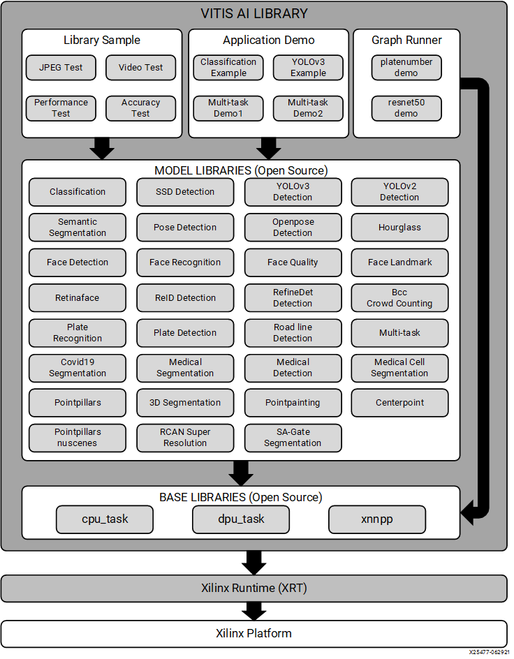

<table width="100%">
  <tr width="100%">
    <td align="center"><h1>Vitis AI Library v1.3</h1>
    </td>
 </tr>
 </table>

# Introduction
The Vitis AI Library is a set of high-level libraries and APIs built for efficient AI inference with Deep-Learning Processor Unit (DPU). It is built based on the Vitis AI Runtime with Unified APIs, and it fully supports XRT 2020.2.

The Vitis AI Library provides an easy-to-use and unified interface by encapsulating many efficient and high-quality neural networks. This simplifies the use of deep-learning neural networks, even for users without knowledge of deep-learning or FPGAs. The Vitis AI Library allows users to focus more on the development of their applications, rather than the underlying hardware.

For edge users, click 
[Quick Start For Edge](#quick-start-for-edge) to get started quickly. 

For cloud users, click 
[Quick Start For Alveo](#quick-start-for-alveo) to get started quickly.

## Key Features And Enhancements in 1.3 Release
1. New Boards Support:
	* Versal VCK190
2. New Model Libraries:
	* pointpillars detection
	* covid19 segmentation
	* medical detection
	* medical cell segmentaton
	* hourglass pose detection
	* retinaface detection
	* face quality
	* 3D segmentation
3. Up to 36 new models are supported:
	* Added 13 new Pytorch models
	* Added 17 new TensorFlow models, including 5 TensorfFow2 models
	* Added 6 new Caffe models
4. New DPU Support:
	* DPUCAHX8L
5. Xmodel is Supported for Edge
6. Pytorch Framework is Supported for Edge

## Block Diagram

<p align="center">
  
</p>

## Directory Structure Introduction

```
Vitis_AI_Library
├── 3Dsegmentation
├── ai_library_diagram.png
├── benchmark
├── carplaterecog
├── cifar10classification
├── classification
├── cmake
├── CMakeLists.txt
├── cmake.sh
├── Copyright.txt
├── covid19segmentation
├── cpu_task
├── dpu_task
├── facedetect
├── facedetectrecog
├── facefeature
├── facelandmark
├── facequality5pt
├── facerecog
├── general1
├── hourglass
├── lanedetect
├── math
├── medicaldetection
├── medicalsegcell
├── medicalsegmentation
├── mnistclassification
├── model_config
├── multitask
├── openpose
├── overview
├── platedetect
├── platenum
├── platerecog
├── pointpillars
├── posedetect
├── README.md
├── refinedet
├── reid
├── reidtracker
├── retinaface
├── runner_helper
├── sample_client
├── segmentation
├── ssd
├── tfssd
├── tracker
├── usefultools
├── xnnpp
├── yolov2
└── yolov3
```

## Quick Start For Edge
### Setting Up the Host
1. Download the [sdk-2020.2.0.0.sh](https://www.xilinx.com/bin/public/openDownload?filename=sdk-2020.2.0.0.sh)

2. Install the cross-compilation system environment, follow the prompts to install. 

**Please install it on your local host linux system, not in the docker system.**
```
./sdk-2020.2.0.0.sh
```
Note that the `~/petalinux_sdk` path is recommended for the installation. Regardless of the path you choose for the installation, make sure the path has read-write permissions. 
Here we install it under `~/petalinux_sdk`.

3. When the installation is complete, follow the prompts and execute the following command.
```
source ~/petalinux_sdk/environment-setup-aarch64-xilinx-linux
```
Note that if you close the current terminal, you need to re-execute the above instructions in the new terminal interface.

4. Download the [vitis_ai_2020.2-r1.3.2.tar.gz](https://www.xilinx.com/bin/public/openDownload?filename=vitis_ai_2020.2-r1.3.2.tar.gz) and install it to the petalinux system.
```
tar -xzvf vitis_ai_2020.2-r1.3.2.tar.gz -C ~/petalinux_sdk/sysroots/aarch64-xilinx-linux
```

5. To compile the library sample in the AI Library, take `facedetect` as an example, execute the following command.
```
cd ~/Vitis-AI/demo/Vitis-AI-Library/samples/facedetect
bash -x build.sh
```	

6. To modify the library source code, view and modify them under `~/Vitis-AI/tools/Vitis-AI-Library`.
	Before compiling the AI libraries, please confirm the compiled output path. The default output path is : `$HOME/build`.
	If you want to change the default output path, please modify the `build_dir_default` in cmake.sh. 
	Execute the following command to build the libraries all at once.
```
cd ~/Vitis-AI/tools/Vitis-AI-Library
./cmake.sh --clean
```

### Setting Up the Target
**To improve the user experience, the Vitis AI Runtime packages, VART samples, Vitis-AI-Library samples and
models have been built into the board image. Therefore, user does not need to install Vitis AI
Runtime packages and model package on the board separately. However, users can still install
the model or Vitis AI Runtime on their own image or on the official image by following these
steps.**

1. Installing a Board Image.
	* Download the SD card system image files from the following links:  
	
		[ZCU102](https://www.xilinx.com/bin/public/openDownload?filename=xilinx-zcu102-dpu-v2020.2-v1.3.1.img.gz)  
	
		[ZCU104](https://www.xilinx.com/bin/public/openDownload?filename=xilinx-zcu104-dpu-v2020.2-v1.3.1.img.gz)  
	
      	Note: The version of the board image should be 2020.2 or above.
	* Use Etcher software to burn the image file onto the SD card.
	* Insert the SD card with the image into the destination board.
	* Plug in the power and boot the board using the serial port to operate on the system.
	* Set up the IP information of the board using the serial port.
	You can now operate on the board using SSH.

2. (Optional) Running `zynqmp_dpu_optimize.sh` to optimize the board setting.
	
	The script runs automatically by default after the board boots up with the official image.
	But you can also download the `dpu_sw_optimize.tar.gz` from [here](../../dsa/DPU-TRD/app/dpu_sw_optimize.tar.gz).
	```
	cd ~/dpu_sw_optimize/zynqmp/
	./zynqmp_dpu_optimize.sh
	```	

3. (Optional) How to update Vitis AI Model and install it separately. 	

	For each model, there will be a yaml file which is used for describe all the details about the model. 
	In the yaml, you will find the model's download links for different platforms. Please choose the corresponding model and download it.  
	Click [Xilinx AI Model Zoo](../../models/AI-Model-Zoo/model-list) to view all the models.
	* Download the model according to the model's yaml file. Take `densebox_320_320` of ZCU102 as an example.
	```
	  wget https://www.xilinx.com/bin/public/openDownload?filename=densebox_320_320-zcu102_zcu104-r1.3.1.tar.gz -O densebox_320_320-zcu102_zcu104-r1.3.1.tar.gz
	```	
	* Copy the downloaded file to the board using scp with the following command. 
	```
	  scp densebox_320_320-zcu102_zcu104-r1.3.1.tar.gz root@IP_OF_BOARD:~/
	```
	* Log in to the board (using ssh or serial port) and install the model package.
	```
	  tar -xzvf densebox_320_320-zcu102_zcu104-r1.3.1.tar.gz
	  cp densebox_320_320 /usr/share/vitis_ai_library/models -r
	```

4. (Optional) How to update Vitis AI Runtime and install them separately. 

	If you want to update the Vitis AI Runtime or install them to your custom board image, follow these steps.
	* Download the [Vitis AI Runtime 1.3.2](https://www.xilinx.com/bin/public/openDownload?filename=vitis-ai-runtime-1.3.2.tar.gz).  
	
	* Untar the runtime packet and copy the following folder to the board using scp.
	```
	tar -xzvf vitis-ai-runtime-1.3.2.tar.gz
	scp -r vitis-ai-runtime-1.3.2/aarch64/centos root@IP_OF_BOARD:~/
	```
	* Log in to the board using ssh. You can also use the serial port to login.
	* Install the Vitis AI Runtime. Execute the following command.
	```
	cd centos
	bash setup.sh
	```
	Note if you update the VART to 1.3.2 and want to run the sample program, make sure you also use the latest sample code.

	 	  
### Running Vitis AI Library Examples

1. Download the [vitis_ai_library_r1.3.x_images.tar.gz](https://www.xilinx.com/bin/public/openDownload?filename=vitis_ai_library_r1.3.1_images.tar.gz) and 
the [vitis_ai_library_r1.3.x_video.tar.gz](https://www.xilinx.com/bin/public/openDownload?filename=vitis_ai_library_r1.3.0_video.tar.gz). Copy them from host to the target using scp with the following command.
```
[Host]$scp vitis_ai_library_r1.3.x_images.tar.gz root@IP_OF_BOARD:~/
[Host]$scp vitis_ai_library_r1.3.x_video.tar.gz root@IP_OF_BOARD:~/
```
2. Untar the image and video packages on the target.
```
cd ~
tar -xzvf vitis_ai_library_r1.3.*_images.tar.gz -C Vitis-AI/demo/Vitis-AI-Library
tar -xzvf vitis_ai_library_r1.3.*_video.tar.gz -C Vitis-AI/demo/Vitis-AI-Library
```
3. Enter the directory of example in target board, take `facedetect` as an example.
```
cd ~/Vitis-AI/demo/Vitis-AI-Library/samples/facedetect
```
4. Run the image test example.
```
./test_jpeg_facedetect densebox_320_320 sample_facedetect.jpg
```

5. Run the video test example.
```
./test_video_facedetect densebox_320_320 video_input.webm -t 8

Video_input.mp4: The video file's name for the input. The user needs to prepare the video file by themselves.
-t: <num_of_threads>
```

Note that, for examples with video input, only `webm` and `raw` format are supported by default with the official system image. 
If you want to support video data in other formats, you need to install the relevant packages on the system. 

6. To test the program with a USB camera as input, run the following command:
```
./test_video_facedetect densebox_320_320 0 -t 8

0: The first USB camera device node. If you have multiple USB camera, the value might be 1,2,3 etc.
-t: <num_of_threads>
```
7. To test the performance of model, run the following command:
```
./test_performance_facedetect densebox_320_320 test_performance_facedetect.list -t 8 -s 60

-t: <num_of_threads>
-s: <num_of_seconds>
```

## Quick Start For Alveo
### Setting Up the Host for U50/U50lv/U280

1. Follow [Setup Alveo Accelerator Card with HBM for DPUCAHX8H/L](../../setup/alveo/u50_u50lv_u280/README.md) to set up the Alveo Card.

2. Download the xclbin files from [here](https://www.xilinx.com/bin/public/openDownload?filename=alveo_xclbin-1.3.1.tar.gz). Untar it, choose the Alveo card and install it. Take `U50`
as an example.
```
cd /workspace
wget https://www.xilinx.com/bin/public/openDownload?filename=alveo_xclbin-1.3.1.tar.gz -O alveo_xclbin-1.3.1.tar.gz
tar -xzvf alveo_xclbin-1.3.1.tar.gz
cd alveo_xclbin-1.3.1/U50/6E300M
sudo cp dpu.xclbin hbm_address_assignment.txt /usr/lib
```  
For `DPUCAHX8L`, take `U50lv` as an example.
```
cd /workspace
wget https://www.xilinx.com/bin/public/openDownload?filename=alveo_xclbin-1.3.1.tar.gz -O alveo_xclbin-1.3.1.tar.gz
tar -xzvf alveo_xclbin-1.3.1.tar.gz
cd alveo_xclbin-1.3.1/U50lv-V3ME/1E250M
sudo cp dpu.xclbin /opt/xilinx/overlaybins/
export XLNX_VART_FIRMWARE=/opt/xilinx/overlaybins/dpu.xclbin
```
Note that for `DPUCAHX8L`, please refer to [XBulter Installation](../../setup/alveo/u200_u250/packages) to install `XBulter`. After the installation of `XBulter`, reboot xbulter service.
```
sudo service xbutler restart
```

3. Select the model for your platform.  
	For each model, there will be a yaml file which is used for describe all the details about the model. 
	In the yaml, you will find the model's download links for different platforms. Please choose the corresponding model and download it.  
	Click [Xilinx AI Model Zoo](../../models/AI-Model-Zoo/model-list) to view all the models.

	* Download the model according to the model's yaml file. Take `densebox_320_320` of U50 as an example.
	```
	  wget https://www.xilinx.com/bin/public/openDownload?filename=densebox_320_320-u50-r1.3.1.tar.gz -O densebox_320_320-u50-r1.3.1.tar.gz
	```
	  For `DPUCAHX8L`, take `U50lv` as an example.  
	```
	  wget https://www.xilinx.com/bin/public/openDownload?filename=densebox_320_320-u50-u50lv-u280-v3me-r1.3.1.tar.gz -O densebox_320_320-u50-u50lv-u280-v3me-r1.3.1.tar.gz
	```	  
	* Install the model package.  
	If the `/usr/share/vitis_ai_library/models` folder does not exist, create it first.
	```
	  sudo mkdir /usr/share/vitis_ai_library/models
	```	
	Then install the model package.
	```
	  tar -xzvf densebox_320_320-u50-r1.3.1.tar.gz
	  sudo cp densebox_320_320 /usr/share/vitis_ai_library/models -r
	```
	  For `DPUCAHX8L`, execute the following commands to install the model package.
	```
	  tar -xzvf densebox_320_320-u50-u50lv-u280-v3me-r1.3.1.tar.gz
	  sudo cp densebox_320_320 /usr/share/vitis_ai_library/models -r
	```
	  
**Note that different alveo cards correspond to different model files, which cannot be used alternately.** 

4. To compile the AI Library sample, take `classification` as an example, execute the following command.
```
cd /workspace/demo/Vitis-AI-Library/samples/classification
bash -x build.sh
```		

5. To modify the library source code, view and modify them under `/workspace/Vitis-AI/tools/Vitis-AI-Library`.
	Before compiling the AI libraries, please confirm the compiled output path. The default output path is : `$HOME/build`.
	If you want to change the default output path, please modify the `build_dir_default` in cmake.sh. 
	Execute the following command to build the libraries all at once.
```
cd /workspace/tools/Vitis-AI-Library
./cmake.sh --clean
```

### Running Vitis AI Library Examples for U50/U50lv/U280
Suppose you have downloaded `Vitis-AI`, entered `Vitis-AI` directory, and then started Docker. 
Thus, `Vitis-AI-Libray` examples are located in the path of `/workspace/demo/Vitis-AI-Library/` in the docker system. 

**`/workspace/demo/Vitis-AI-Library/` is the path for the following example.**
 
If you encounter any path errors in running examples, check to see if you follow the steps above.

1. Download the [vitis_ai_library_r1.3.x_images.tar.gz](https://www.xilinx.com/bin/public/openDownload?filename=vitis_ai_library_r1.3.1_images.tar.gz) and [vitis_ai_library_r1.3.x_video.tar.gz](https://www.xilinx.com/bin/public/openDownload?filename=vitis_ai_library_r1.3.0_video.tar.gz) packages and untar them.
```
cd /workspace
wget https://www.xilinx.com/bin/public/openDownload?filename=vitis_ai_library_r1.3.1_images.tar.gz -O vitis_ai_library_r1.3.1_images.tar.gz
wget https://www.xilinx.com/bin/public/openDownload?filename=vitis_ai_library_r1.3.0_video.tar.gz -O vitis_ai_library_r1.3.0_video.tar.gz
tar -xzvf vitis_ai_library_r1.3.1_images.tar.gz -C demo/Vitis-AI-Library/
tar -xzvf vitis_ai_library_r1.3.0_video.tar.gz -C demo/Vitis-AI-Library/
```
2. Enter the directory of sample and then compile it. Take `facedetect` as an example.
```
cd /workspace/demo/Vitis-AI-Library/samples/facedetect
bash -x build.sh
```
3. Run the image test example.
```
./test_jpeg_facedetect densebox_320_320 sample_facedetect.jpg
```
4. Run the video test example.
```
./test_video_facedetect densebox_320_320 video_input.mp4 -t 8

Video_input.mp4: The video file's name for input. The user needs to prepare the video file by themselves.
-t: <num_of_threads>
```
5. To test the performance of model, run the following command:
```
./test_performance_facedetect densebox_320_320 test_performance_facedetect.list -t 8 -s 60

-t: <num_of_threads>
-s: <num_of_seconds>
```

### Setting Up the Host for Alveo-U200/Alveo-U250

1. Follow [Setup Alveo-U200/U250](../../setup/alveo/u200_u250/README.md) cards page to setup your cards on the host system (skip if already done).

:pushpin: **Note:** Please make sure you are already inside Vitis-AI docker

2. Activate conda environment. 
```sh
conda activate vitis-ai-caffe
```

3. To build the `DPUCADX8G` or `DPUCADF8H` supported examples in the AI Library, run as below.
```
cd /vitis_ai_home/tools/Vitis-AI-Library
```
For `DPUCADX8G`:
```
./cmake.sh --clean --type=release --cmake-options=-DCMAKE_PREFIX_PATH=$CONDA_PREFIX --cmake-options=-DENABLE_DPUCADX8G_RUNNER=ON
```
For `DPUCADF8H`:
```
./cmake.sh --clean --type=release --cmake-options=-DCMAKE_PREFIX_PATH=$CONDA_PREFIX --cmake-options=-DENABLE_DPUCADF8H_RUNNER=ON
```
This will generate AI libraries and executable files to under `build_dir_default`.

:pushpin: **Note:** To modify the library source code, view and modify them under `/vitis_ai_home/tools/Vitis-AI-Library`. Before compiling the AI libraries, please confirm the compiled output path. The default output path is : `$HOME/build`. If you want to change the default output path, please modify the `build_dir_default` in cmake.sh.

### Running Vitis AI Library Examples on Alveo-U200/Alveo-U250 with `DPUCADX8G`:
1. Download and untar the model package.
```
$wget -O vai_lib_u200_u250_models.tar.gz https://www.xilinx.com/bin/public/openDownload?filename=vai_lib_u200_u250_models.tar.gz
$sudo tar -xvf vai_lib_u200_u250_models.tar.gz --absolute-names
```
:pushpin: **Note:** All models will download to `/usr/share/vitis_ai_library/models` directory. Currently supported networks for `DPUCADX8G` are classification, facedetect, facelandmark, reid and yolov3. And currently supported networks for `DPUCADF8H` are `tf_inceptionv1_imagenet_224_224_3G_1.3` and `tf_resnetv1_50_imagenet_224_224_6.97G_1.3`.

2. Download the [vitis_ai_library_r1.3.x_images.tar.gz](https://www.xilinx.com/bin/public/openDownload?filename=vitis_ai_library_r1.3.1_images.tar.gz) package and untar. Extracted images can be found under `samples` folder.
```
cd /vitis_ai_home/tools/Vitis-AI-Library
wget https://www.xilinx.com/bin/public/openDownload?filename=vitis_ai_library_r1.3.1_images.tar.gz -O vitis_ai_library_r1.3.1_images.tar.gz
tar -xzvf vitis_ai_library_r1.3.1_images.tar.gz
```

3. Setup the environment.
```
source ${VAI_HOME}/setup/alveo/u200_u250/overlaybins/setup.sh
export LD_LIBRARY_PATH=<vitis-ai-library lib path>:$LD_LIBRARY_PATH
```
:pushpin: **Note:** The default library install path for vitis-ai-library is `$HOME/.local/<target>/lib`.

4. Run the classification image test example.
```
<vitis-ai-library build path>/Vitis-AI-Library/classification/test_classification <model_dir> <img_path>

Example:
~/build/build.Ubuntu.18.04.x86_64.Release/Vitis-AI-Library/classification/test_classification inception_v1 <img_path>
```
:pushpin: **Note:** The default build path for vitis-ai-library is `$HOME/build/<target>/Vitis-AI-Library/`.
### Running Vitis AI Library Examples on Alveo-U200/Alveo-U250 with `DPUCADF8H`:
1. Download and untar the model package.
```
wget -O inception_v1_tf-u200-u250-r1.3.0.tar.gz https://www.xilinx.com/bin/public/openDownload?filename=inception_v1_tf-u200-u250-r1.3.0.tar.gz
wget -O resnet_v1_50_tf-u200-u250-r1.3.0.tar.gz https://www.xilinx.com/bin/public/openDownload?filename=resnet_v1_50_tf-u200-u250-r1.3.0.tar.gz
tar -xvf inception_v1_tf-u200-u250-r1.3.0.tar.gz
tar -xvf resnet_v1_50_tf-u200-u250-r1.3.0.tar.gz 
```
:pushpin: **Note:** Currently supported networks for `DPUCADF8H` are `tf_inceptionv1_imagenet_224_224_3G_1.3` and `tf_resnetv1_50_imagenet_224_224_6.97G_1.3`.

2. Download the [vitis_ai_library_r1.3.x_images.tar.gz](https://www.xilinx.com/bin/public/openDownload?filename=vitis_ai_library_r1.3.1_images.tar.gz) package and untar. Extracted images can be found under `samples` folder.
```
cd /vitis_ai_home/tools/Vitis-AI-Library
wget https://www.xilinx.com/bin/public/openDownload?filename=vitis_ai_library_r1.3.1_images.tar.gz -O vitis_ai_library_r1.3.1_images.tar.gz
tar -xzvf vitis_ai_library_r1.3.1_images.tar.gz
```

3. Setup the environment.
```sh
source ${VAI_HOME}/setup/alveo/u200_u250/overlaybins/setup.sh
export LD_LIBRARY_PATH=<vitis-ai-library lib path>:$LD_LIBRARY_PATH

# Set below for Alveo-U250
export XLNX_VART_FIRMWARE=/opt/xilinx/overlaybins/dpuv3int8/dpdpuv3_wrapper.hw.xilinx_u250_xdma_201830_2.xclbin

# Set below for Alveo-U200
export XLNX_VART_FIRMWARE=/opt/xilinx/overlaybins/dpuv3int8/dpdpuv3_wrapper.hw.xilinx_u200_xdma_201830_2.xclbin
```
:pushpin: **Note:** The default library install path for vitis-ai-library is `$HOME/.local/<target>/lib`.

4. Run the classification image test example.
```
<vitis-ai-library build path>/Vitis-AI-Library/classification/test_classification <model_dir> <img_path>

Example:
~/build/build.Ubuntu.18.04.x86_64.Release/Vitis-AI-Library/classification/test_classification inception_v1_tf <img_path>
```
:pushpin: **Note:** The default build path for vitis-ai-library is `$HOME/build/<target>/Vitis-AI-Library/`.

## Tools
In this release, `xdputil` tool is introduced for board developing. It's preinstalled in the latest board image or docker. The source code of `xdputil` is under `usefultools`.
* Show device information, including DPU, fingerprint and VAI version. 
```
xdputil query
```
* Show xmodel information, including xmodel's inputs&outputs and kernels
```
xdputil xmodel <xmodel> -l
```
* Convert xmodel to the other format
```
xdputil xmodel <xmodel> -t <TXT> 
xdputil xmodel <xmodel> -s <SVG>
xdputil xmodel <xmodel> -p <PNG> 
```
* Test xmodel performance
```
xdputil benchmark <xmodel> [-i subgraph_index] <num_of_threads>
```
For more usage of `xdputil`, execute `xdputil -h`.

Note that when you use `xdputil` in the docker, `/usr/bin/python3 -m xdputil` is used instead of `xdputil`, for example,
```
/usr/bin/python3 -m xdputil query
```

## Reference
For more information, please refer to [vitis-ai-library-user-guide](https://www.xilinx.com/support/documentation/sw_manuals/vitis_ai/1_3/ug1354-xilinx-ai-sdk.pdf).
