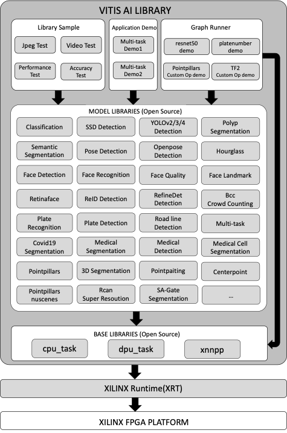

<table width="100%">
  <tr width="100%">
    <td align="center"><h1>Vitis AI Library v1.4</h1>
    </td>
 </tr>
 </table>

# Introduction
The Vitis AI Library is a set of high-level libraries and APIs built for efficient AI inference with Deep-Learning Processor Unit (DPU). It is built based on the Vitis AI Runtime with Unified APIs, and it fully supports XRT 2020.2.

The Vitis AI Library provides an easy-to-use and unified interface by encapsulating many efficient and high-quality neural networks. This simplifies the use of deep-learning neural networks, even for users without knowledge of deep-learning or FPGAs. The Vitis AI Library allows users to focus more on the development of their applications, rather than the underlying hardware.

For edge users, click 
[Quick Start For Edge](#quick-start-for-edge) to get started quickly. 

For cloud users, click 
[Quick Start For Cloud](#quick-start-for-cloud) to get started quickly.

## Key Features And Enhancements in 1.4 Release
1. New Boards Support:
	* SoM KV260
2. New Model Libraries:
	* pointpainting sensor fusion
	* pointpillars nuscenes
	* centerpoint detection
	* SA-Gate segmentaton
	* bayesian crowd counting
	* production recognition
	* multi-task V3
	* rcan super resolution
3. Up to 16 new models are supported:
	* Added 10 new Pytorch models
	* Added 5 new TensorFlow models, including 1 TensorfFow2 models
	* Added 1 new Caffe models
4. New DPU Support:
	* Enhanced DPUCVDX8G with ALU
5. New Deploy APIs Support:
	* graph_runner is introduced to deploy model with multiple subgraphs
6. New Tool Support:
	* xdputil is introduced for dpu and xmodel debug

## Block Diagram

<p align="center">
  
</p>


## Quick Start For Edge
### Setting Up the Host
1. Follow steps in [Setting Up the Host](../../setup/mpsoc/VART#step1-setup-cross-compiler) to set up the host for edge.

2. To modify the library source code, view and modify them under `~/Vitis-AI/tools/Vitis-AI-Library`.
	Before compiling the AI libraries, please confirm the compiled output path. The default output path is : `$HOME/build`.
	If you want to change the default output path, please modify the `build_dir_default` in cmake.sh. 
	Execute the following command to build the libraries all at once.
```
cd ~/Vitis-AI/tools/Vitis-AI-Library
./cmake.sh --clean
```

### Setting Up the Target  
For `MPSOC`, follow steps in [Setting Up the Target](../../setup/mpsoc/VART#step2-setup-the-target) to set up the target.  
For `VCK190`, follow steps in [Setting Up the Target](../../setup/vck190#step2-setup-the-target) to set up the target.

	 	  
### Running Vitis AI Library Examples

1. Download the [vitis_ai_library_r1.4.x_images.tar.gz](https://www.xilinx.com/bin/public/openDownload?filename=vitis_ai_library_r1.4.0_images.tar.gz) and 
the [vitis_ai_library_r1.4.x_video.tar.gz](https://www.xilinx.com/bin/public/openDownload?filename=vitis_ai_library_r1.4.0_video.tar.gz). Copy them from host to the target using scp with the following command.
```
[Host]$scp vitis_ai_library_r1.4.*_images.tar.gz root@IP_OF_BOARD:~/
[Host]$scp vitis_ai_library_r1.4.*_video.tar.gz root@IP_OF_BOARD:~/
```
2. Untar the image and video packages on the target.
```
cd ~
tar -xzvf vitis_ai_library_r1.4.*_images.tar.gz -C Vitis-AI/demo/Vitis-AI-Library
tar -xzvf vitis_ai_library_r1.4.*_video.tar.gz -C Vitis-AI/demo/Vitis-AI-Library
```
3. Enter the directory of example in target board, take `facedetect` as an example.
```
cd ~/Vitis-AI/demo/Vitis-AI-Library/samples/facedetect
```
4. Run the image test example.
```
./test_jpeg_facedetect densebox_320_320 sample_facedetect.jpg
```

5. Run the video test example.
```
./test_video_facedetect densebox_320_320 video_input.webm -t 8

Video_input.mp4: The video file's name for the input. The user needs to prepare the video file by themselves.
-t: <num_of_threads>
```

Note that, for examples with video input, only `webm` and `raw` format are supported by default with the official system image. 
If you want to support video data in other formats, you need to install the relevant packages on the system. 

6. To test the program with a USB camera as input, run the following command:
```
./test_video_facedetect densebox_320_320 0 -t 8

0: The first USB camera device node. If you have multiple USB camera, the value might be 1,2,3 etc.
-t: <num_of_threads>
```
7. To test the performance of model, run the following command:
```
./test_performance_facedetect densebox_320_320 test_performance_facedetect.list -t 8 -s 60

-t: <num_of_threads>
-s: <num_of_seconds>
```

## Quick Start For Cloud
### Setting Up the Host for U50/U50LV/U280

1. Follow [Setup Alveo Accelerator Card](../../setup/alveo) to set up the Alveo Card.

2. Suppose you have followed the above steps to enter docker container and executed the following commands.  
	Take `U50 DPUCAHX8H` as an example.
	```
	cd /workspace/setup/alveo
	source setup.sh DPUCAHX8H
	```

### Setting Up the Host for VCK5000
Follow [Setting Up the Host](../../setup/vck5000) to set up the host for VCK5000.

### Running Vitis AI Library Examples for U50/U50lv/U280/VCK5000

Suppose you have downloaded `Vitis-AI`, entered `Vitis-AI` directory, and then started Docker. 
Thus, `Vitis-AI-Libray` examples are located in the path of `/workspace/demo/Vitis-AI-Library/` in the docker system. 

**`/workspace/demo/Vitis-AI-Library/` is the path for the following example.**
 
If you encounter any path errors in running examples, check to see if you follow the steps above.

1. Select the model for your platform.  
	For each model, there will be a yaml file which is used for describe all the details about the model. 
	In the yaml, you will find the model's download links for different platforms. Please choose the corresponding model and download it. Click [Xilinx AI Model Zoo](../../models/AI-Model-Zoo/model-list) to view all the models. For DPUCAHX8H of U50, take `resnet50` as an example.

	* Download the model according to the model's yaml file.
	```
	wget https://www.xilinx.com/bin/public/openDownload?filename=resnet50-u50-u50lv-u280-DPUCAHX8H-r1.4.0.tar.gz -O resnet50-u50-u50lv-u280-DPUCAHX8H-r1.4.0.tar.gz
	```

	* Install the model package.  
	If the `/usr/share/vitis_ai_library/models` folder does not exist, create it first.
	```
	  sudo mkdir /usr/share/vitis_ai_library/models
	  tar -xzvf resnet50-u50-u50lv-u280-DPUCAHX8H-r1.4.0.tar.gz
	  sudo cp resnet50 /usr/share/vitis_ai_library/models -r
	```	

**Note that different alveo cards correspond to different model files, which cannot be used alternately.** 

2. Download the [vitis_ai_library_r1.4.x_images.tar.gz](https://www.xilinx.com/bin/public/openDownload?filename=vitis_ai_library_r1.4.0_images.tar.gz) and [vitis_ai_library_r1.4.x_video.tar.gz](https://www.xilinx.com/bin/public/openDownload?filename=vitis_ai_library_r1.4.0_video.tar.gz) packages and untar them.
```
cd /workspace
wget https://www.xilinx.com/bin/public/openDownload?filename=vitis_ai_library_r1.4.0_images.tar.gz -O vitis_ai_library_r1.4.0_images.tar.gz
wget https://www.xilinx.com/bin/public/openDownload?filename=vitis_ai_library_r1.4.0_video.tar.gz -O vitis_ai_library_r1.4.0_video.tar.gz
tar -xzvf vitis_ai_library_r1.4.0_images.tar.gz -C demo/Vitis-AI-Library/
tar -xzvf vitis_ai_library_r1.4.0_video.tar.gz -C demo/Vitis-AI-Library/
```
3. Enter the directory of sample and then compile it.
```
cd /workspace/demo/Vitis-AI-Library/samples/classification
bash -x build.sh
```
4. Run the image test example.
```
./test_jpeg_classification resnet50 sample_classification.jpg
```
5. Run the video test example.
```
./test_video_classification resnet50 <video_input.mp4> -t 8

Video_input.mp4: The video file's name for input. The user needs to prepare the video file by themselves.
-t: <num_of_threads>
```
6. To test the performance of model, run the following command:
```
./test_performance_classification resnet50 test_performance_classification.list -t 8 -s 60

-t: <num_of_threads>
-s: <num_of_seconds>
```

### Setting Up the Host for Alveo-U200/Alveo-U250

1. Follow [Setup Alveo Accelerator Card](../../setup/alveo) to set up the Alveo Card.

2. Suppose you have followed the above steps to enter docker container and executed the following commands.  
	Take `DPUCADF8H` as an example.
	```
	cd /workspace/setup/alveo
	source setup.sh DPUCADF8H
	```

:pushpin: **Note:** Please make sure you are already inside Vitis-AI docker

3. To build the `DPUCADF8H` supported examples in the AI Library, run as below.
```
cd /vitis_ai_home/tools/Vitis-AI-Library
./cmake.sh --clean --type=release --cmake-options=-DCMAKE_PREFIX_PATH=$CONDA_PREFIX --cmake-options=-DENABLE_DPUCADF8H_RUNNER=ON
```
This will generate AI libraries and executable files to under `build_dir_default`.

:pushpin: **Note:** To modify the library source code, view and modify them under `/vitis_ai_home/tools/Vitis-AI-Library`. Before compiling the AI libraries, please confirm the compiled output path. The default output path is : `$HOME/build`. If you want to change the default output path, please modify the `build_dir_default` in cmake.sh.

### Running Vitis AI Library Examples on Alveo-U200/Alveo-U250 with `DPUCADF8H`:
1. Download and untar the model package.
```
wget -O inception_v1_tf-u200-u250-r1.4.0.tar.gz https://www.xilinx.com/bin/public/openDownload?filename=inception_v1_tf-u200-u250-r1.4.0.tar.gz
wget -O resnet_v1_50_tf-u200-u250-r1.4.0.tar.gz https://www.xilinx.com/bin/public/openDownload?filename=resnet_v1_50_tf-u200-u250-r1.4.0.tar.gz
tar -xvf inception_v1_tf-u200-u250-r1.4.0.tar.gz
tar -xvf resnet_v1_50_tf-u200-u250-r1.4.0.tar.gz 
```
:pushpin: **Note:** Currently supported networks for `DPUCADF8H` are `tf_inceptionv1_imagenet_224_224_3G_1.4` and `tf_resnetv1_50_imagenet_224_224_6.97G_1.4`.

2. Download the [vitis_ai_library_r1.4.x_images.tar.gz](https://www.xilinx.com/bin/public/openDownload?filename=vitis_ai_library_r1.4.0_images.tar.gz) package and untar. Extracted images can be found under `samples` folder.
```
cd /vitis_ai_home/tools/Vitis-AI-Library
wget https://www.xilinx.com/bin/public/openDownload?filename=vitis_ai_library_r1.4.0_images.tar.gz -O vitis_ai_library_r1.4.0_images.tar.gz
tar -xzvf vitis_ai_library_r1.4.0_images.tar.gz
```

3. Setup the environment.
```sh
source ${VAI_HOME}/setup/alveo/setup.sh DPUCADF8H
export LD_LIBRARY_PATH=<vitis-ai-library lib path>:$LD_LIBRARY_PATH
```
:pushpin: **Note:** The default library install path for vitis-ai-library is `$HOME/.local/<target>/lib`.

4. Run the classification image test example.
```
<vitis-ai-library build path>/Vitis-AI-Library/classification/test_classification <model_dir> <img_path>

Example:
~/build/build.Ubuntu.18.04.x86_64.Release/Vitis-AI-Library/classification/test_classification inception_v1_tf <img_path>
```
:pushpin: **Note:** The default build path for vitis-ai-library is `$HOME/build/<target>/Vitis-AI-Library/`.

## Tools
In this release, `xdputil` tool is introduced for board developing. It's preinstalled in the latest board image. The source code of `xdputil` is under `usefultools`.
* Show device information, including DPU, fingerprint and VAI version. 
```
xdputil query
```
* Show the status of DPU
```
xdputil status
```
* Run DPU with the input file.
```
xdputil run <xmodel> [-i <subgraph_index>] <input_bin>

xmodel: The model run on DPU
-i : The subgraph_index of the model, the default value is 0
input_bin: The input file for the model
```
* Show xmodel information, including xmodel's inputs&outputs and kernels
```
xdputil xmodel <xmodel> -l
```
* Convert xmodel to the other format
```
xdputil xmodel <xmodel> -t <TXT> 
xdputil xmodel <xmodel> -s <SVG>
xdputil xmodel <xmodel> -p <PNG> 
```
* Test xmodel performance
```
xdputil benchmark <xmodel> [-i subgraph_index] <num_of_threads>
```
For more usage of `xdputil`, execute `xdputil -h`.

Note that `xdputil` is not available for cloud DPUs in VAI1.4.

## Reference
For more information, please refer to [vitis-ai-library-user-guide](https://www.xilinx.com/support/documentation/sw_manuals/vitis_ai/1_4/ug1354-xilinx-ai-sdk.pdf).
