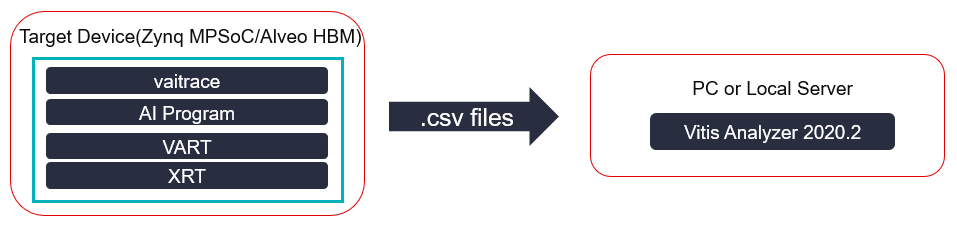

<p align="center">
    
</p>

# Xilinx Vitis AI Profiler

## Overview

Vitis-AI Profiler is an application level tool that could help to optimize the whole AI application. The main purpose of Vitis-AI profiler is to help detect bottleneck of the whole AI application.With Vitis-AI Profiler, you can profile the pre-processing functions and the post-processing functions together with DPU kernels' running status. If the profiling result shows that one pre-processing function takes very long time, it leads to a high CPU utilization and DPU cores wait a long time for CPUs to finish processing. In this situation, we find that the pre-processing and CPU is the bottleneck. if user want to improve performance, try to rewrite this pre-processing function with HLS or OpenCL to reduce CPU's workload.
- It’s easy to use, this tool requires neither any change in user’s code nor re-compilation of the program
- Figuring out hot spots or bottlenecks of preference at a glance
- Illustrating the running state of difference computing units(CPU/DPU/might be AIE in the future)

There are two components of this tool named vaitrace and vaiprofiler
- vaitrace:
Running on devices, take the responsibility for data collection
- vaiprofiler
Running on a PC or local server take responsibility for analyzation and visualization

## What's New
### v1.3 
- Use Vitis Analyzer 2020.2 as default GUI
- Support profiling for Vitis-AI python applications
- Fix various vaitrace bugs

## Vitis AI Profiler Architecture
<div align="center">
<br></br>

</div>  

## Why Vitis AI Profiler
### What's the benefit of this tool
- An all-in-one profiling soution for Vitis-AI
- Vitis-AI is a heterogeneous system, it's complicated, so that we need a more powerful and customized tool for profiling. The Vitis AI Profiler could be used for a application level profiling. For a AI application, there will be some parts running on hardward, for example, neural network computation usually runs on DPU, and also, there are some parts of the AI application running on CPU as a function that was implemented by c/c++ code like image pre-processing. This tool could help put the running status of all parts together. So that, we get a all-in-one profilling tool for Vitis-AI applications. 

### What Information Can Be Obtained from This Tool

<p align="center"> Vitis AI Profiler GUI Overview</p>

From Vitia-AI v1.3, [Vitis Analyzer](https://www.xilinx.com/html_docs/xilinx2020_2/vitis_doc/jfn1567005096685.html) is the default GUI for vaitrace

- DPU Summary
    <p align="center"></p>

- Information about hardware on running
  - Memory Bandwidth: real-time AXI port traffic only available for edge devices now)
    - User can see details about the traffic(including read and write) of each AXI port
- Real-time throughput for AI inference throughput(FPS)
    - More details will be shown while mouse moving over
      <p align="center"></p>


## Get Started with Vitis AI Profiler
-	System Requirements:
    - Hardware:
        - Support Zynq MPSoC (DPUCZD series)
        - Support Alveo (DPUCAH series)
    - Software:
        - Support VART v1.3+
        - Support Vitis AI Library v1.3+

- Installing:
    -	Preparing debug environment for vaitrace in MPSoC platform  
        These steps are _not_ required for Vitis AI prebuilt board images for ZCU102 & ZCU104 https://github.com/Xilinx/Vitis-AI/tree/master/VART#setting-up-the-target   

        1.	Configure and Build Petalinux:  
        Run _petalinux-config -c kernel_ and Enable these for Linux kernel:

          ```
            General architecture-dependent options ---> [*] Kprobes
            Kernel hacking  ---> [*] Tracers
            Kernel hacking  ---> [*] Tracers  --->
            			[*]   Kernel Function Tracer
            			[*]   Enable kprobes-based dynamic events
            			[*]   Enable uprobes-based dynamic events
          ```

        2. Run _petelinux-config -c rootfs_ and enable this for root-fs:
          ```
            user-packages  --->  modules   --->
          				[*]   packagegroup-petalinux-self-hosted
          ```

        3. Run _petalinux-build_ and update kernel and rootfs

    - Preparing debug environment for docker
      If you are using Vitis AI with docker, please add this patch to docker_run.sh to get root permission for vaitrace  
      **This step is only required for Vitis-AI Docker**
      ```diff
      --- a/docker_run.sh
      +++ b/docker_run.sh
      @@ -94,6 +94,7 @@ if [[ $IMAGE_NAME == *"gpu"* ]]; then
           -e USER=$user -e UID=$uid -e GID=$gid \
           -e VERSION=$VERSION \
           -v $HERE:/workspace \
      +    -v /sys/kernel/debug:/sys/kernel/debug  --privileged=true \
           -w /workspace \
           --rm \
           --runtime=nvidia \
      @@ -111,6 +112,7 @@ else
           -e USER=$user -e UID=$uid -e GID=$gid \
           -e VERSION=$VERSION \
           -v $HERE:/workspace \
      +    -v /sys/kernel/debug:/sys/kernel/debug  --privileged=true \
           -w /workspace \
           --rm \
           --network=host \

      ```
      Due to an issue of overlay-fs, to support all the features of Vitis-AI Profiler in docker environment, it requires a linux kernel release v4.8 or higher on your host machine, see [here](https://lore.kernel.org/patchwork/patch/890633/)


## Vaitrace Usage
### Command Line Usage
```bash
# vaitrace --help
usage: Xilinx Vitis AI Trace [-h] [-c [CONFIG]] [-d] [-o [TRACESAVETO]] [-t [TIMEOUT]] [-v]

  cmd   Command to be traced
  -b    Bypass mode, just run command and by pass vaitrace, for debug use
  -c [CONFIG]       Specify the configuration file
  -o [TRACESAVETO]  Save trace file to
  -t [TIMEOUT]      Tracing time limitation
  --va              Generate trace data for Vitis Analyzer(Default format)
  --xat             Generate trace data in .xat(Only available for Zynq devices)

```
### Get Start with vaitrace  
Here use the 'test_performance' program of Vitis AI Library’s yolo_v3 sample as an example:
  - Setup Vitis_AI_Library and prepare test images, see [here](https://github.com/Xilinx/Vitis-AI/blob/master/Vitis-AI-Library/README.md) 
  - Vaitrace requires root permission
  ```bash
      # sudo bash
  ```
  - Entry Vitis-AI-Library yolov3 sample directory
  ```bash
      # cd /workspace/Vitis-AI-Library/overview/samples/yolov3 # for Alveo docker
      # cd ~/Vitis-AI-Library/overview/samples/yolov3 # for edge boards
  ```  
  - See readme in sample directory and the test command is
    ```bash
    # vaitrace -t 20 ./test_performance_yolov3 yolov3_voc ./test_performance_yolov3.list
    ```
    1. The first argument [-t 20] stands for vaitrace tracing for 20 seconds
    2. The rest parts of above command is the target command to run
    3. Several .csv files(vart_trace.csv/profile_summary.csv ...) and xclbin.ex.run_summary will be generated
    4. Copy all .csv files and xclbin.ex.run_summary from working directory to your PC (via scp or nfs)
    5. Open the xclbin.ex.run_summary by Vitis Analyzer: File -> Open Summary

### Frequently-used arguments
  - cmd: cmd is your executable program of vitis-ai that want to be traced  

  -	-t  control the tracing time(in seconds) starting from the [cmd] being launched, default value is 3, if no -t is specified, the tracing will stop after [cmd] running for 3 seconds, [cmd] will continue to run as normal, but tracing data collecting will be stop  
  It’s recommended that: trace about 50~500 times of vitis-ai inference run at once, determine how many seconds to trace by considering FPS of your AI program
      -	Less than 50 may not enough for some statistic information
      -	More than 500 will slow down the system significantly  
    
  -	-o  where to save trace file (.xat), by default, the .xat file will be saved to current working directory, and be named as the same as executable program plus .xat as suffix
  -	-c  users can start a trace with more custom options by writing these a json  format configuration file and specify the configuration by -c, details of configuration file will be explained in the next section
  - --va generate trace data for Vitis Analyzer, this option is enabled by default
  - --xat generate trace data in .xat, the .xat can be opened by the leagcy web-based Vitis-AI Profiler, this option is disabled by default
  -	Others arguments are used for debug

### Configuration
Another way to launch a trace is to save all necessary information for vaitrace into a configuration file then use vaitrace -c [cfg_name.json]

- Configuration priority: Configuration File > Command Line > Default

- Here is an example of vaitrace configuration file
    ```json
    {
      "options": {
          "runmode": "normal",
          "cmd": "/workspace/Vitis-AI-Library/overview/samples/classification/test_jpeg_classification resnet50 /workspace/Vitis-AI-Library/overview/samples/classification/images/001.JPEG",
          "output": "./trace_resnet50.xat",
          "timeout": 5
      },
      "trace": {
          "enable_trace_list": ["vitis-ai-library", "opencv", "vart", "custom"]
      },
      "trace_custom": []
    }
    ```
    |  Key | Sub-level Key | Type | Description |
    |  :-  | :- | :-: | :- |
    | options  |  | object |  |
    |   | cmd | string | the same with command line argument cmd |
    |   | output | string | the same with command line argument -o |
    |   | timeout | integer | the same with command line argument -t |
    |   | runmode | string | Xmodel run mode control, can be “debug” or “normal”, if runmode == “debug” VART will control xmodel run in a debug mode by using this, user can achieve **fine-grained profiling** for xmodel. For .elf type mode, only "normal" is valid |
    | trace  |  | object | |
    |  | enable_tracelist | list_of_string |enable_trace_list	list	Built-in trace function list to be enabled, available value **"vitis-ai-library", "vart", “opencv”, "custom"**, custom for function in trace_custom list|
    |  trace_custom | | list_of_string | trace_custom	list	The list of functions to be traced that are implemented by user. For the name of function, naming space are supported. You can see an example of using custom trace function later in this document|
		

### Example of VART based program profiling:
- Preparing 
  ```bash
  # cd path-to-vart-resnet50-samples
  ```
  - Setup environment
  - Remove cv::imshow and cv::waitKey from main.cc so that this program could run continuously
  - Build this sample

  From the source code, we found that **TopK** and **softmax** task will be done by CPU, and we want to check the performance of these two functions, so write the name of these two functions to trace_custom list, and save this file as trace_resnet50_vart.json.  
  For edge devices: 
  ```json
  {
      "options": {
          "runmode": "normal",
          "cmd": "./resnet50 model_dir_for_zcu104/resnet50.elf",
          "output": "./trace_vart_resnet50.xat",
          "timeout": 3
      },
      "trace": {
          "enable_trace_list": ["vart", "opencv", "custom"]
      },
      "trace_custom": [ "TopK", "CPUCalcSoftmax"]
  }

  ```
  For alveo devices, this sample uses xmodel, so it will have a different launch command
  ```json
  {
      "options": {
          "runmode": "normal",
          "cmd": "./resnet50 model_dir_for_U50/resnet50.xmodel",
          "output": "./trace_vart_resnet50.xat",
          "timeout": 3
      },
      "trace": {
          "enable_trace_list": ["vart", "opencv", "custom"]
      },
      "trace_custom": [ "TopK", "CPUCalcSoftmax"]
  }
  ```

- Start a trace:
  ```bash
  # vaitrace -c trace_resnet50_vart.json
  ```
  note: vaitrace requires root permission

- Upload csv files and xclbin.ex.run_summary and open the xclbin.ex.run_summary in Vitis Analyzer 2020.2

### Example of profiling VART based python application
- Preparing 
  ```bash
  # cd path-to-vart-resnet50_mt_py sample
  ```
- Modifing code: we are about to profile Vitis-AI and some code of resnet50.py need to be changed
  1. Improt vai_tracepoint from vaitrace_py
  2. Add @vai_tracepoint as decorator to functions that we want to trace
  3. Uncomment CPUCalcSoftmax and TopK
  
  ```diff
  --- a/examples/VART/samples/resnet50_mt_py/resnet50.py
  +++ b/examples/VART/samples/resnet50_mt_py/resnet50.py
  @@ -25,6 +25,7 @@ import math
   import threading
   import time
   import sys
  +from vaitrace_py import vai_tracepoint

   """
   Calculate softmax
  @@ -33,7 +34,7 @@ size: data size
   return: softamx result
   """

  +@vai_tracepoint
   def CPUCalcSoftmax(data, size):
       sum = 0.0
       result = [0 for i in range(size)]
  @@ -56,7 +57,7 @@ datain: data result of softmax
   filePath: filePath in witch that records the infotmation of kinds
   """

  +@vai_tracepoint
   def TopK(datain, size, filePath):

       cnt = [i for i in range(size)]
  @@ -136,9 +137,9 @@ def runResnet50(runner: "Runner", img, cnt):
           """softmax&TopK calculate with batch """
           """Benchmark DPU FPS performance over Vitis AI APIs execute_async() and wait() """
           """Uncomment the following code snippet to include softmax calculation for model<E2><80><99>s end-to-end FPS evaluation """
  -        #for j in range(runSize):
  -        #    softmax = CPUCalcSoftmax(outputData[0][j], pre_output_size)
  -        #    TopK(softmax, pre_output_size, "./words.txt")
  +        for j in range(runSize):
  +            softmax = CPUCalcSoftmax(outputData[0][j], pre_output_size)
  +            TopK(softmax, pre_output_size, "./words.txt")

           count = count + runSize
   """
   ```
  - Use __python3 -m vaitrace_py__ to start the trace
   ```bash
   # python3 -m vaitrace_py ./resnet50.py 2 resnet50.xmodel
   ```
  - Copy all .csv files and xclbin.ex.run_summary from working directory to you PC or Server
  - Use Vitis Analyzer 2020.2 to open xclbin.ex.run_summary

### Example of Profiling DPU together with HLS/OpenCL Kernels:
tbd