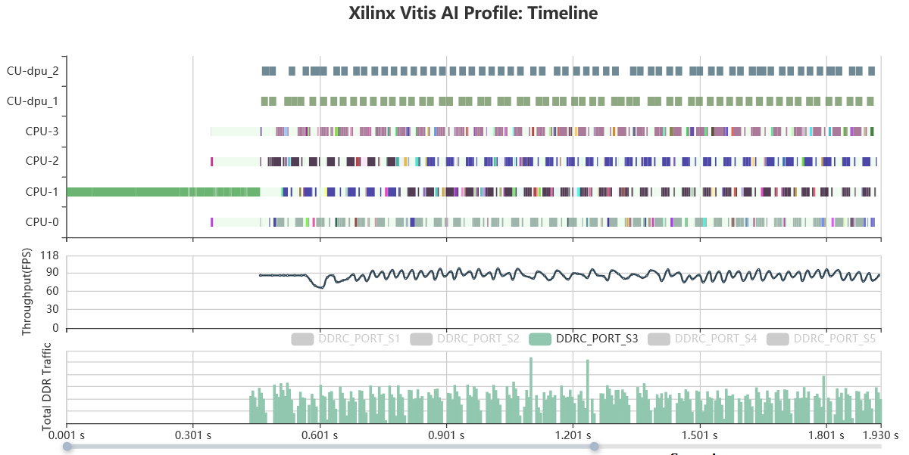

<p align="center">
    
</p>

# Xilinx Vitis AI Profiler Web GUI

## Overview

Vitis-AI Profiler is an application level tool that could help to optimize the whole AI application. The main purpose of Vitis-AI profiler is to help detect bottleneck of the whole AI application.With Vitis-AI Profiler, you can profile the pre-processing functions and the post-processing functions together with DPU kernels' running status. If the profiling result shows that one pre-processing function takes very long time, it leads to a high CPU utilization and DPU cores wait a long time for CPUs to finish processing. In this situation, we find that the pre-processing and CPU is the bottleneck. if user want to improve performance, try to rewrite this pre-processing function with HLS or OpenCL to reduce CPU's workload.
- It’s easy to use, this tool requires neither any change in user’s code nor re-compilation of the program
- Figuring out hot spots or bottlenecks of preference at a glance
- Illustrating the running state of difference computing units(CPU/DPU/might be AIE in the future)

There are two components of this tool named vaitrace and vaiprofiler
- vaitrace:
Running on devices, take the responsibility for data collection
- vaiprofiler
Running on a PC or local server take responsibility for analyzation and visualization

## Vitis AI Profiler Architecture
<div align="center">
<table border="1">
    <tbody style="text-align: center;">
    <tr>
        <th>vaitrace</th>
        <th>vaiprofiler</th>
    </tr>
    <tr>
        <td>Simple to use, the same interface with the classical Linux profiling tools (strace and ltrace)</td>
        <td>A web application that could be easily deployed(need python as a run-time)</td>
    </tr>
    <tr>
        <td>Based on Linux trace infrastructures (Ftrace/Kprobe/Uprobe)</td>
        <td>Compatible with Windows(need WSL2)/Linux</td>
    </tr>
    <tr>
        <td>Collecting data of Vitis AI library and recording to a .xat format file</td>
        <td>Upload the .xat file</td>
    </tr>
    <tr>
        <td>Rich and flexible features that can be configured</td>
        <td>Auto analyze and show the report</td>
    </tr>
    </tbody>
</table>
<br></br>

</div>  

## Why Vitis AI Profiler
### What's the benefit of this tool
- An all-in-one profiling soution for Vitis-AI
- Light-weight, software and hardware mixed profiling
- Vitis-AI is a heterogeneous system, it's complicated, so that we need a more powerful and customized tool for profiling. The Vitis AI Profiler could be used for a application level profiling. For a AI application, there will be some parts running on hardward, for example, neural network computation usually runs on DPU, and also, there are some parts of the AI application running on CPU as a function that was implemented by c/c++ code like image pre-processing. This tool could help put the running status of all parts together. So that, we get a all-in-one profilling tool for Vitis-AI applications. 

### What Information Can Be Obtained from This Tool

<p align="center"> Vitis AI Profiler GUI Overview</p>

- A union timeline that shows running status of different compute units in FPGA

  - CPU: Function call stack graph and CPU busy/idle state, all AI Library relevant function calls will be highlighted on the timeline 
  - For CPU tasks, different color indicates different thread, on the screenshot below, we can find five different colors that stand for five different threads
    - All of these five threads are forked by the Vitis AI Library
    - The first pink one that is in charge of loading and resizing picture from disk to memory
    - The other four threads that are in charge of processing AI tasks, including per-processing post-processing and scheduling tasks for DPUs
    <p align="center"></p>

    - DPUs' Every task running will be show on the timeline
    - DPU and other PL compute units can be supported(e.g. softmax or resize IP if exists)
    - Mouse move over the block will highlight it and show the run time of this task
  - For DPU tasks, the utilization of DPUs (in time dimension) could be see very clearly from this graph
    <p align="center"></p>


- Information about hardware on running
  - Memory Bandwidth: real-time AXI port traffic only available for edge devices now)
    - User can see details about the traffic(including read and write) of each AXI port
- Real-time throughput for AI inference throughput(FPS)
    - More details will be shown while mouse moving over
      <p align="center"></p>

- At the right half panel of the profiler window, there are two tabs which can be clicked on
    -	Hardware information about hardware platform, and if the target platform is zynq MPSoC DPU hardware information could be found here also
    -	A series of key performance indicator of CPUs and DPUs, including CPU/DPU utilization and DPU average latency for tasks
    <p align="center"></p>

## Get Started with Vitis AI Profiler
- Installing:
    - Deploy the web server (Vitis AI Profiler) on PC or local server, setting up this web server doesn't depend on Vitis AI docker image. It's recommend to deploy this out the docker container.
        1. Clone the Vitis AI project from github repo 
           ```bash
           # cd /path-to-vitis-ai/Vitis-AI-Profiler
           ```
        2. Requirements: 
            - Python 3.6+
            - Flask which you can get from 
              ```bash
              # pip3 install --user flask
              ```
        3. Start the web Server on PC or Local Network Server 
            ```bash
            # python3 vaiProfiler.py
            ```
           By default (run with no argument) the IP address is 127.0.0.1(localhost) and port number is 8008, user can access the web page by http://localhost:8008.  
           To change the port number or IP address, these options could be use:  
	         ```
	         --ip ip_address
	         --port port_number  
	         ```
	         For example: __python3 vaiProfiler.py --port 8009__ will deploy this web server to http://localhost:8009


- Starting trace with vaitrace  
See the example

- Uploading:
    - Open the Vitis AI Profiler with your browser by default URL is http://127.0.0.1:8008
    - Click 'Browse...' button to select the .xat file then click 'Upload'  
       <p align="center"></p>

    - After a while, it jumps to profiler page, there are four parts on the profiler page
      1. Timeline  
      The timeline is categorized by hardware components users can tell hardware utilization with just a single glance. All Vitis AI relative tasks are high-lighted, and the other progress are filtered out.  
      For CPU tasks in timeline, different color indicates different thread, click on color block in the timeline it shows the details in the tree-grid table below
      2. Throughtput  
      Show real-time Vitis AI Library inference FPS
      3. DDR memory controller traffic, available for Zynq MPSoC only  
      Total AXI read and write traffic via DDR controller port S1-S5, S0 will not be connect to DPU, so S0 be ignored
      4. Information Table  
      Show CPU/Memory/DPU relative information


## Vitis AI Profiler Usage
### Manage uploaded .xat files:
Click on [Manage Uploaded Files] on front-page, that we can see a file management page, that we can find uploaded .xat files:
  - All items are ranked by uploaded time, so that files could find easily
  - Click on the ID number will jump to the report 
  - Click on the file name can download the uploaded .xat file
  - Click on the [x] will remove the file from server
  <p align="center"></p>
