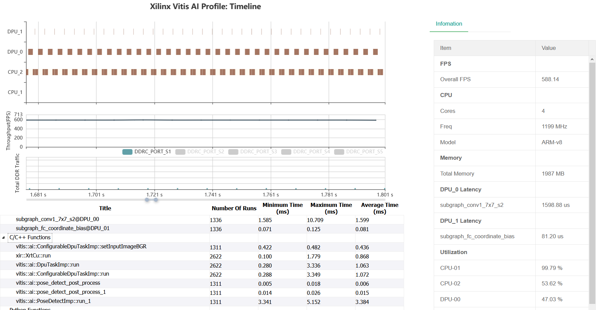
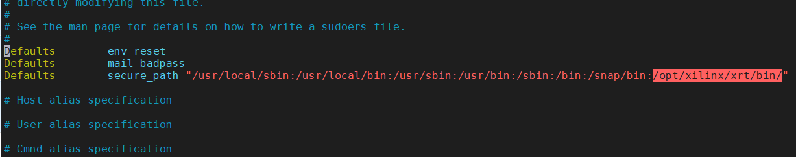
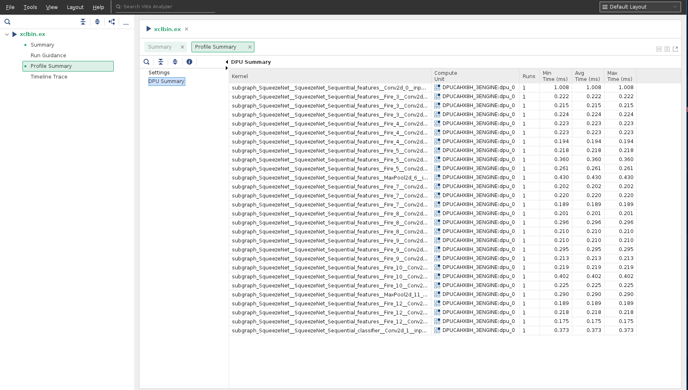
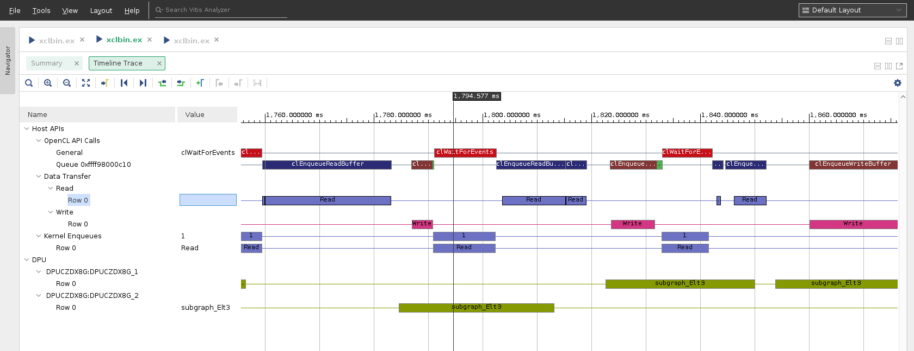

<p align="center">
    
</p>

# Xilinx Vitis AI Profiler

## DPU Profiling Examples
### VART C++ Program Profiling Using Configuration File
- Device  
  Edge: ZCU104
- Preparing 
  ```bash
  # cd path-to-vart-resnet50-samples
  ```
  - Remove cv::imshow and cv::waitKey from main.cc so that this program could run continuously
  - Build the sample

  From the source code, we found that **TopK** and **softmax** task will be done by CPU, and we want to check the performance of these two functions, so write the name of these two functions to trace_custom list, and save this file as trace_resnet50_vart.json.  
  For edge devices: 
  ```json
  {
      "options": {
          "runmode": "normal",
          "cmd": "/home/root/Vitis-AI/demo/VART/samples/resnet50/resnet50 /usr/share/vitis_ai_library/models/resnet50/resnet50.xmodel"
      },
      "trace": {
          "enable_trace_list": ["vart", "opencv", "custom"]
      },
      "trace_custom": ["TopK", "CPUCalcSoftmax"]
  }

  ```

- Starting Trace:
  ```bash
  # vaitrace -c trace_resnet50_vart.json
  ```
  note: vaitrace requires root permission

- Result
Upload all csv files and xclbin.ex.run_summary and open the xclbin.ex.run_summary in Vitis Analyzer 2020.2

### VART Python Program Profiling
- Device  
  Edge: ZCU104
- Preparing 
  ```bash
  # cd path-to-vart-resnet50_mt_py sample
  ```
  - Modifing code: we are about to profile Vitis-AI and some code of resnet50.py need to be changed
    1. Improt vai_tracepoint from vaitrace_py
    2. Add __@vai_tracepoint__ as decorator to functions that we want to trace
    3. Uncomment CPUCalcSoftmax and TopK
     ```diff
     --- a/demo/VART/samples/resnet50_mt_py/resnet50.py
     +++ b/demo/VART/samples/resnet50_mt_py/resnet50.py
     @@ -25,6 +25,7 @@ import math
      import threading
      import time
      import sys
     +from vaitrace_py import vai_tracepoint

      """
      Calculate softmax
     @@ -33,7 +34,7 @@ size: data size
      return: softamx result
      """

     +@vai_tracepoint
      def CPUCalcSoftmax(data, size):
          sum = 0.0
          result = [0 for i in range(size)]
     @@ -56,7 +57,7 @@ datain: data result of softmax
      filePath: filePath in witch that records the infotmation of kinds
      """

     +@vai_tracepoint
      def TopK(datain, size, filePath):

          cnt = [i for i in range(size)]
     @@ -136,9 +137,9 @@ def runResnet50(runner: "Runner", img, cnt):
              """softmax&TopK calculate with batch """
              """Benchmark DPU FPS performance over Vitis AI APIs execute_async() and wait() """
              """Uncomment the following code snippet to include softmax calculation for models end-to-end FPS evaluation """
     -        #for j in range(runSize):
     -        #    softmax = CPUCalcSoftmax(outputData[0][j], pre_output_size)
     -        #    TopK(softmax, pre_output_size, "./words.txt")
     +        for j in range(runSize):
     +            softmax = CPUCalcSoftmax(outputData[0][j], pre_output_size)
     +            TopK(softmax, pre_output_size, "./words.txt")

              count = count + runSize
      """
      ```
- Starting Trace
  - Use __python3 -m vaitrace_py__ to start the trace
   ```bash
   # python3 -m vaitrace_py ./resnet50.py 2 resnet50.xmodel
   ```
- Result  
  Upload all csv files and xclbin.ex.run_summary and open the xclbin.ex.run_summary in Vitis Analyzer 2020.2

### Using the Legacy Vitis-AI Profiler Web GUI
- Notes  
  In Vitis-AI v1.3,the Legacy Vitis-AI Profiler Web GUI only support ZynqMPSoC devices, if you're trying on Alveo devices, just using Vitis Analyzer 2020.2
- Devices  
Edge: ZCU104
- Preparing 
  ```bash
  # cd ~/Vitis-AI/demo/Vitis-AI-Library/samples/posedetect
  ```
- Starting Trace:
  ```bash
  # vaitrace --xat -t 5 -o test_posedet.xat ./test_performance_posedetect sp_net ./test_performance_posedetect.list 
  ```
- Result  
  - Upload test_posedet.xat to PC
  - [Deploy the Vitis-AI Profiler web server](./README_LEGACY.md)
  - Open this xat file in broswer
    <p align="center"></p>

### Fine Grained Profiling
Fine grained profiling will force the xmodel run in debug model, and the result shows performance of each layer in the model
- Device  
Cloud: Alveo U50
- Model  
squeezenet_pytorch
- Preparing 
  1. Modify docker_run.sh to get debug permission
      ```diff
      --- a/docker_run.sh
      +++ b/docker_run.sh
      @@ -89,6 +89,7 @@ docker_run_params=$(cat <<-END
           -e USER=$user -e UID=$uid -e GID=$gid \
           -e VERSION=$VERSION \
           -v $DOCKER_RUN_DIR:/vitis_ai_home \
      +    -v /sys/kernel/debug:/sys/kernel/debug  --privileged=true \
           -v $HERE:/workspace \
           -w /workspace \
           --rm \
      ```
  2. Run the docker
      ```bash
      $ ./docker_run.sh xilinx/vitis-ai-cpu:latest
      ```
  3. Setup Vitis-AI Environment  
  [Quick Start For Alveo](https://github.com/Xilinx/Vitis-AI/blob/master/demo/VART/README.md)
  4. Vaitrace requires XRT's xbutil tool, in Vitis-AI docker, before using vaitrace, we need some modification to get the special permission, edit the sudoers file and add XRT path(/opt/xilinx/xrt/bin/) to secure_path:  
      ```bash
      $ sudo visudo
      ```
      <p align="center"></p>

  5. Prepare configure file for fine grained profiling, save the json format configure as file squeezenet_pt_debug.json   
      ```json
      {
        "options": {
            "runmode": "debug"
        }
      }
      ```
- Starting Trace
  ```bash
  $ cd /workspace/demo/VART/squeezenet_pytorch
  $ chmod 777 ./
  $ sudo -E vaitrace -c ./squeezenet_pt_debug.json ./squeezenet_pytorch /usr/share/vitis_ai_library/models/squeezenet_pt/squeezenet_pt.xmodel
  ```
  - "sudo -E" is used to get root permission and preserve existing environment variables
  - "vaitrace -c ./squeezenet_pt_debug.json" is used to start vaitrace for profiling and specify configure file
  - the rest is the launching command for squeezenet_pytorch demo
 
- Result  
  vaitrace and XRT generate five files in total, four trace data files with .csv postfix and one summary file named xclbin.ex.run_summary, using vitis_analyzer to open the summary then click [Profile Summary] -> [DPU Summary]
  ```bash
  $ vitis_analyzer ./xclbin.ex.run_summary
  ```
  <p align="center"></p>
  
### Profiling DPU together with HLS/OpenCL Kernels
- Configuration  
  In the XRT 2020.2 and Vitis-AI 1.3 release, there are two distinct profiling paths in XRT. One is OpenCL profiling, enabled by "profile=true" and "timeline_trace=true",The second profiling path is enabled by "xrt_profile=true" option and the vaitrace is compatible with the second path only, and __"vitis_ai_profile=true" will be enabled by vaitrace automatically__. So, for 2020.2, it would recommend the following structure in xrt.ini file to profiling DPU and HLS/OpenCL kernels together:
  ```
  [Debug]
  xrt_profile=true
  lop_trace=true
  ```
- Result  
  - Collect all csv files and xclbin.ex.run_summary
  - Open the run summary by Vitis Analyzer, it show OpenCL API calls and DPU events on the same timeline
    <p align="center"></p>
