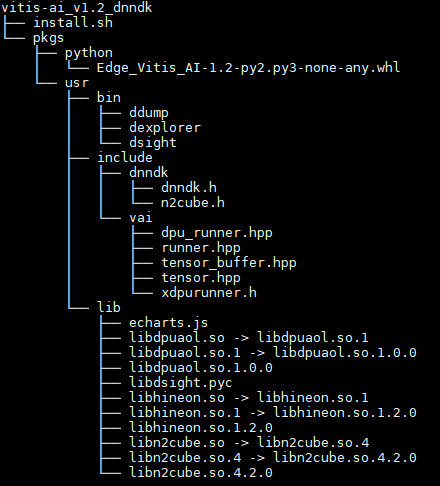

This is the source code package of Vitis AI DNNDK runtime, usually it will be compiled and output package vitis-ai_v1.2_dnndk.tar.gz. The structure of the output package is as follows.

<br />
<div align="center">
  
</div>
<br />

You have multi ways to compile this source code. Please choose from the following items to find the steps that suit your situation.
* sdk.sh corss compile exported by Petalinux
* gcc on arm64 target board
* gcc on arm target board
* gcc-aarch64-linux-gnu corss compile
* gcc-arm-linux-gnueabihf corss compile

## Cross compilation wih sdk.sh
 - Use Bash shell to install sdk.sh
 - Execute the following command to load environment variables
   ```
   source /opt/petalinux/2020.1/environment-setup-aarch64-xilinx-linux
   ```
 - Change diretory to the source code of vitis-ai-dnndk
   ```
   cd vitis-ai-dnndk
   ```
 - Modify Makefile.cfg
   ```
   vim Makefile.cfg
   ```
 - Execute the make command
   ```
   make
   ```
 - This is an option to support python, and you need install setuptools and wheel for python first
   ```
   make python
   ```
 - Generate vitis-ai_v1.2_dnndk.tar.gz
   ```
   make package
   ```

## Compilation directly on target board
 - Change diretory to the source code of vitis-ai-dnndk
   ```
   cd vitis-ai-dnndk
   ```
 - Modify Makefile.cfg
   ```
   vim Makefile.cfg
   ```
 - Execute the make command
   ```
   make
   ```
 - Install the generated libraries 
   ```
   make install
   ```
 - This is an option to support python, and you need install setuptools and wheel for python first
   ```
   make python
   cd n2cube/python/dist/
   ```
 - Install package for python on target board
   ```
   pip install Edge_Vitis_AI-1.2-py2.py3-none-any.whl
   ```
 - Install package for python3 on target board
   ```
   pip3 install  Edge_Vitis_AI-1.2-py2.py3-none-any.whl
   ```

## Cross compilation with GNU Toolchain
 - Change diretory to the source code of vitis-ai-dnndk
   ```
   cd vitis-ai-dnndk
   ```
 - Modify Makefile.cfg, if you want to build python support pacakge you need install setuptools and wheel for python first
   ```
   vim Makefile.cfg
   ```
 - Use gcc-aarch64-linux-gnu to generate vitis-ai_v1.2_dnndk.tar.gz 
   ```
   make SYSROOT=<the sysroot path of target board> CROSS_COMPILE=aarch64-linux-gnu-
   ```
 - Use gcc-arm-linux-gnueabihf to generate vitis-ai_v1.2_dnndk.tar.gz
   ```
   make SYSROOT=<the sysroot path of target board> CROSS_COMPILE=arm-linux-gnueabihf-
   ```

## Build DPU Driver
The running environment of this source code package defaults to XRT, but you can still choose to use the traditional DPU driver. You can generate dpu.ko by the following command or your own way.
 - Change diretory to vitis-ai-dnndk/driver
   ```
   cd vitis-ai-dnndk/driver
   ```
 - For UltraScale+ MPSoC can be compiled using the following command
   ```
   make ARCH=arm64 CROSS_COMPILE=aarch64-linux-gnu- KERNELDIR=/path/to/your/kernel
   ```
 - For Zynq 7000 MPSoC can be compiled using the following command
   ```
   make ARCH=arm CROSS_COMPILE=arm-linux-gnueabihf- KERNELDIR=/path/to/your/kernel
   ```
